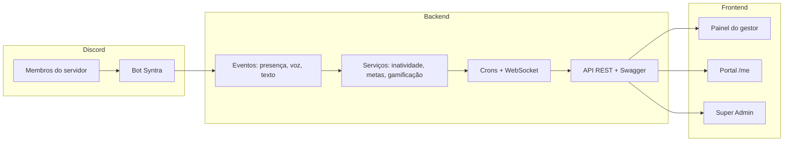

# Syntra — Visão do sistema e brief para design

Documento de referência sobre **o que é o Syntra**, **como funciona**, **para quem é destinado** e **persona/brief para designers** desenharem telas.

---

## O que é e para que serve

**Syntra** é um SaaS B2B de **colaboração** para times remotos que usam o **Discord** como canal principal de trabalho. A proposta central não é medir “produtividade” nem substituir ferramentas de gestão de projetos — é responder uma pergunta operacional antes que vire problema:

> **“Quem sumiu esta semana?”**

O produto monitora **sinais passivos de colaboração** no Discord (presença, voz, atividade em texto) e transforma isso em **alertas de inatividade**, **relatórios**, **metas individuais** e, opcionalmente, **gamificação leve**. Tudo isso **sem armazenar conteúdo de mensagens, áudio ou DMs** — apenas metadados.

**Tagline:** *“Saiba quem está colaborando — e quem sumiu — no Discord do seu time.”*

**Substitui na prática:** o timer manual (tipo Toggl) para **visibilidade de colaboração** do time remoto. **Não substitui:** Jira, Slack, timesheet legal, alocação por cliente/projeto ou métricas de entrega (PRs, tickets).

---

## Como funciona (fluxo do sistema)



### 1. Coleta passiva (bot Discord)

Um bot conectado ao servidor do cliente observa:

| Sinal | O que mede | Privacidade |
|-------|------------|-------------|
| **Presença** | ONLINE, IDLE, DND, OFFLINE | Status apenas |
| **Voz colaborativa** | Tempo em calls de trabalho | Não grava áudio |
| **Texto colaborativo** | Atividade em canais de trabalho | Só metadados (canal, timestamp, tipo de evento) |

Canais são classificados via UI: colaborativos, AFK, almoço ou ignorados. **Nada disso vem de variáveis de ambiente** — tudo é configurado no sistema.

### 2. Contexto de calendário e ausências

Para evitar falsos positivos, o sistema considera:

- **Calendário de trabalho** da organização (jornada, feriados BR, dias úteis)
- **Ausências planejadas (PTO)** — férias, licenças, etc.
- **Metas individuais** por colaborador (horas colaborativas esperadas)

Quem está de férias ou em dia não útil **não aparece como “sumiu”**.

### 3. Core: inatividade (“quem sumiu”)

Crons e serviços comparam o esperado vs. o observado:

- **Intraday:** quem deveria estar colaborando hoje e não está
- **Semanal:** snapshot de quem “desapareceu” na semana

Esse é o **North Star** do produto — dashboard, push notifications e relatório dedicado giram em torno disso.

### 4. Operação em tempo real

O **Time ao vivo** (`/app/live`) usa WebSocket para mostrar presença, movimentação e ranking operacional do dia — visão “agora”, complementar aos relatórios históricos.

### 5. Gamificação opcional (plano Team+)

Badges, streaks e ranking configurável pelo gestor (métrica, período, visibilidade, top N). É **leve e opcional** — pensada para reforçar colaboração, não para humilhar. Cálculo on-the-fly no MVP (sem histórico persistido de conquistas).

### 6. Multitenancy e papéis

Cada **organização** (tenant) tem dados isolados. Papéis:

| Papel | Quem é | O que faz |
|-------|--------|-----------|
| **Owner / Admin** | Dono ou TI/RH do cliente | Tudo: config, relatórios, billing |
| **Manager** | Líder de time | Relatórios + maioria das configs |
| **Viewer** | Stakeholder | Só leitura de relatórios |
| **Colaborador** | Membro do Discord | Portal `/me` — dados próprios, conquistas, export LGPD |
| **Super Admin** | Operador da plataforma Syntra | Planos, tenants, bot compartilhado |

### 7. Onboarding guiado (8 passos)

Wizard para conectar Discord → escolher servidor → classificar canais → categorizar membros → calendário → metas → inatividade → gamificação. Meta: **time to value < 10 minutos**.

---

## Para quem é destinado

### Cliente ideal (empresa)

- **Times remotos ou híbridos** (10–200 pessoas) que **trabalham no Discord**
- Startups de tech, agências digitais, suporte distribuído, squads de produto
- Gestores que **não têm visibilidade** de quem está “presente” no dia a dia remoto
- Empresas que **rejeitam** monitoramento invasivo (sem ler mensagens, sem screenshot)

### Usuários finais

| Persona | Dor | O que busca no Syntra |
|---------|-----|------------------------|
| **Gestor de engenharia/produto** | “Não sei quem sumiu até a daily” | Alertas, relatório semanal, time ao vivo |
| **Head de People / RH** | Visibilidade sem invadir privacidade | Relatórios agregados, PTO, calendário |
| **Líder de squad** | Metas individuais vs. realizado | Metas, ranking opcional, categorias |
| **Colaborador** | Quer transparência dos próprios dados | Portal `/me`, export LGPD, conquistas |
| **Operador Syntra** | Gerir SaaS, tenants, bot | Painel Super Admin |

### O que o produto **não** é

- Ferramenta de comunidades/gaming como vertical principal
- Timesheet legal/fiscal
- Monitoramento de IDE, Jira ou Slack
- Solução de alocação por cliente/projeto

---

## Princípios de design (obrigatórios)

1. **Terminologia:** sempre **colaboração** / **horas colaborativas** / **quem sumiu** — **nunca** “produtividade”
2. **Privacidade visível:** deixar claro que não há leitura de mensagens
3. **Mobile-first:** PWA responsiva, bottom nav no mobile, touch targets ≥ 44px
4. **Core em destaque:** inatividade é a estrela; gamificação é secundária/opcional
5. **Tom:** operacional e empático — “quem sumiu” é alerta de cuidado, não vigilância punitiva
6. **UI existente:** Angular 21 + TailAdmin + Tailwind — evoluir, não reinventar do zero

---

## Persona para o designer

### Nome: **Camila Rocha** — Engineering Manager, time remoto no Discord

#### Perfil

| Atributo | Detalhe |
|----------|---------|
| **Cargo** | Engineering Manager em startup B2B SaaS (~45 devs) |
| **Idade** | 34 anos |
| **Local** | São Paulo — time 100% remoto, espalhado BR |
| **Stack de comunicação** | Discord (calls, canais de squad, DMs) |
| **Ferramentas** | Jira, GitHub, Notion — **não** usa timer manual |
| **Tech literacy** | Alta — confortável com dashboards e filtros |

#### Contexto do dia a dia

Camila lidera 3 squads. As dailies são async no Discord; syncs acontecem em voice channels. Ela **não consegue “ver” quem está online** sem abrir o Discord e scrollar canais. Já teve casos de dev sumindo 3 dias antes de alguém perceber — impacto em sprint e clima do time.

Ela **rejeita** ferramentas que leem mensagens ou gravam tela. Precisa de algo que **respeite privacidade** mas dê **visibilidade operacional**.

#### Objetivos com o Syntra

1. **Manhã (5 min):** abrir o app e ver **quem sumiu hoje** antes da daily
2. **Semanal:** consultar **Time ao vivo** quando precisa escalar algo urgente
3. **Sexta (10 min):** relatório semanal de inatividade para 1:1s
4. **Mensal:** cruzar **metas individuais** vs. horas colaborativas
5. **Opcional:** ranking gamificado no fim do mês para ritual de time (com visibilidade controlada)

#### Frustrações atuais

- Discord não foi feito para gestão — presença some, status IDLE confunde
- Planilhas manuais de “quem está de férias” desatualizadas
- Medo de parecer “Big Brother” se implementar monitoramento errado
- Não quer mais uma ferramenta — quer **valor em < 10 min** no onboarding

#### Jornada no produto

```
Signup → Onboarding (8 passos) → Dashboard "quem sumiu" → Time ao vivo → Relatórios
                ↓
         Config: canais, categorias, calendário, PTO, metas, inatividade
```

#### Telas prioritárias para o designer desenhar

| # | Tela | Objetivo UX | Elementos-chave |
|---|------|-------------|-----------------|
| 1 | **Dashboard / Início** | Primeiro contato diário — “quem sumiu hoje” | Cards de alerta, contagem, link para relatório, estado vazio amigável |
| 2 | **Relatório de inatividade** (CORE) | Visão semanal/intraday filtrável | Tabela/cards responsivos, filtros por categoria, badges PTO, export |
| 3 | **Time ao vivo** | Snapshot “agora” do time | Grid de membros, status presença/voz, ranking do dia, feel realtime |
| 4 | **Onboarding — passo canais** | Classificar canais Discord visualmente | Seletor visual de canais, tags AFK/almoço/colaborativo, progresso 8 passos |
| 5 | **Metas vs. realizado** | Gestor ajusta expectativa individual | Lista por membro, barra meta/realizado, categorias como sugestão |
| 6 | **Portal colaborador (/me)** | Transparência LGPD + conquistas | Dados próprios, horas colaborativas, badges, botão export |
| 7 | **Config gamificação** | Toggles + preview de ranking | Métrica, período, visibilidade, pacote badges — tom leve, não punitivo |

#### Cenários de uso (user stories para wireframes)

1. *“Abro o Syntra às 9h e vejo 2 pessoas inativas hoje — uma está de PTO (não alerta), outra preciso pingar.”*
2. *“Na quarta, quero filtrar inatividade só do squad Backend.”*
3. *“Configurei ranking semanal por horas colaborativas, visível só para gestores.”*
4. *“Colaborador acessa /me e exporta seus dados — confiança no produto.”*

#### Referências visuais e tom

- **Referência de densidade:** dashboards operacionais (Linear, Datadog) — informação densa, mas escaneável
- **Referência de tom:** Notion/Slack — amigável, não corporativo pesado
- **Evitar:** aesthetic de “employee monitoring” (olho, vermelho alarmista, rankings públicos humilhantes)
- **Paleta sugerida:** alertas em âmbar/laranja (atenção), verde para “ok”, neutros para dados; vermelho só para casos críticos

#### Navegação (já definida — respeitar)

**Desktop sidebar:** Início · Time ao vivo · Relatórios · Configurações  
**Mobile bottom nav:** mesmos 4 atalhos  
**Fora da sidebar:** Onboarding (banner) · Meu portal (menu usuário)

---

## Brief resumido para handoff ao designer

> **Produto:** Syntra — SaaS B2B de colaboração para times remotos no Discord.  
> **Problema:** gestores não sabem quem “sumiu” no trabalho remoto.  
> **Solução:** alertas e relatórios de inatividade baseados em sinais passivos (presença, voz, texto), com calendário, PTO e metas individuais — sem ler mensagens.  
> **Persona principal:** Camila, EM de startup remota, quer visibilidade em 5 min/dia sem parecer vigilância.  
> **Prioridade de telas:** Dashboard → Inatividade → Time ao vivo → Onboarding canais → Metas → Portal /me → Gamificação.  
> **Regra de ouro:** falar em **colaboração**, nunca “produtividade”.

---

## Documentos relacionados

| Documento | Conteúdo |
|-----------|----------|
| [Design spec](superpowers/specs/2026-06-20-pulsedesk-saas-design.md) | Arquitetura, modelos, API, fases |
| [frontend/AGENTS.md](../frontend/AGENTS.md) | Rotas UI, guards, integração API |
| [README.md](../README.md) | Instalação, funcionalidades, API |
