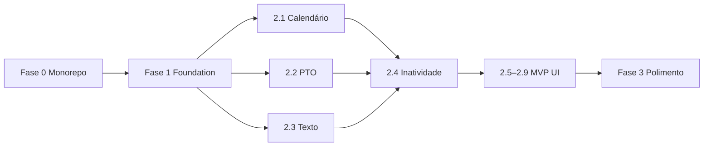

# Syntra SaaS — Plano de Implementação

> **For agentic workers:** REQUIRED SUB-SKILL: Use superpowers:subagent-driven-development (recommended) or superpowers:executing-plans to implement this plan task-by-task. Steps use checkbox (`- [ ]`) syntax for tracking.

**Goal:** Entregar o MVP vendável do Syntra — SaaS multitenant B2B de colaboração no Discord com foco em “quem sumiu”, calendário org, PTO, sinais de texto e billing BRL.

**Architecture:** Monorepo npm workspaces (`backend/` + `frontend/`). Backend Node 22 + Koa + discord.js + Mongoose; bot compartilhado com credenciais no MongoDB (`DiscordApplication`). Toda query multitenant com `organizationId`. Frontend Angular 21 + TailAdmin consome `/api/v1`. Features core em services testados (Vitest/Jasmine) antes da UI.

**Tech Stack:** Node.js 22, TypeScript, Koa, discord.js 14, Mongoose, Vitest, Supertest, mongodb-memory-server, Angular 21, Tailwind 4, Stripe (BRL), web-push, swagger-jsdoc.

**Spec de referência:** [`docs/superpowers/specs/2026-06-20-pulsedesk-saas-design.md`](../specs/2026-06-20-pulsedesk-saas-design.md) (v6)

**Estado atual do repo:** backend em `src/` na raiz (não em `backend/`); frontend TailAdmin em `frontend/` sem integração API; testes em `tests/` na raiz.

---

## Mapa de arquivos (alvo pós-Fase 0)

```
discord-tracker/
├── package.json                    # workspaces: ["backend", "frontend"]
├── docker-compose.yml              # mongodb + backend + frontend
├── backend/
│   ├── src/
│   │   ├── api/routes/             # health, auth, org/*, admin/*
│   │   ├── api/middleware/         # auth, tenant, rbac, rateLimit
│   │   ├── bot/events/             # voice, presence, message, reaction
│   │   ├── db/models/              # Organization, ChannelRule, WorkCalendar…
│   │   ├── repositories/
│   │   ├── services/               # report, inactivity, calendar, absence, text
│   │   ├── workers/                # cron inatividade, absence status
│   │   └── index.ts
│   ├── tests/
│   ├── package.json
│   └── vitest.config.ts
└── frontend/
    └── src/app/
        ├── core/                   # auth, api clients, guards
        └── features/               # landing, onboarding, dashboard, reports, settings
```

---

## Fase 0 — Separação monorepo (semana 1)

**Critério de conclusão:** `npm ci && npm run test --workspace=backend && npm run build --workspace=frontend` passam; `docker compose up` sobe 3 serviços.

### Task 0.1: Criar workspace npm na raiz

**Files:**
- Create: `backend/package.json` (mover deps do root)
- Modify: `package.json` (raiz)
- Move: `src/` → `backend/src/`
- Move: `tests/` → `backend/tests/`
- Move: `vitest.config.ts` → `backend/vitest.config.ts`
- Move: `tsconfig.json` → `backend/tsconfig.json` (se existir na raiz)

- [ ] **Step 1:** Criar `backend/package.json` com scripts e deps do `package.json` atual (sem `copy-views`):

```json
{
  "name": "backend",
  "version": "1.0.0",
  "private": true,
  "main": "dist/index.js",
  "scripts": {
    "build": "tsc",
    "start": "node dist/index.js",
    "dev": "tsx watch src/index.ts",
    "test": "vitest run",
    "test:watch": "vitest",
    "lint": "tsc --noEmit"
  },
  "engines": { "node": ">=22.0.0" }
}
```

- [ ] **Step 2:** Atualizar raiz `package.json`:

```json
{
  "name": "syntra",
  "private": true,
  "workspaces": ["backend", "frontend"],
  "scripts": {
    "test": "npm run test --workspace=backend && npm run test --workspace=frontend",
    "build": "npm run build --workspace=backend && npm run build --workspace=frontend",
    "dev:backend": "npm run dev --workspace=backend",
    "dev:frontend": "npm run start --workspace=frontend"
  }
}
```

- [ ] **Step 3:** Mover pastas (WSL):

```bash
cd /mnt/c/Users/eduar/Documents/Projetos/econdos/discord-tracker
mkdir -p backend
git mv src backend/src
git mv tests backend/tests
git mv vitest.config.ts backend/vitest.config.ts
# tsconfig, Dockerfile, ecosystem.config.js idem se existirem na raiz
```

- [ ] **Step 4:** Ajustar `backend/vitest.config.ts` — paths `src` e `tests` relativos ao backend.

- [ ] **Step 5:** Rodar testes:

```bash
npm ci
npm run test --workspace=backend
```

Expected: todos os testes existentes passam.

- [ ] **Step 6:** Commit

```bash
git add backend/ package.json
git commit -m "chore: migrar backend para backend/ e configurar npm workspaces"
```

---

### Task 0.2: Remover dashboard EJS legado

**Files:**
- Delete: `backend/src/dashboard/` (views EJS + rotas)
- Delete: `backend/src/api/routes/dashboard.ts`, `login.ts`
- Modify: `backend/src/api/server.ts`
- Modify: `backend/package.json` (remover `ejs`, `koa-static`, script `copy-views`)

- [ ] **Step 1:** Remover imports e rotas de dashboard/login em `server.ts`.

- [ ] **Step 2:** Remover deps `ejs`, `@types/ejs`, `koa-static` do `backend/package.json`.

- [ ] **Step 3:** Rodar `npm run build --workspace=backend` e `npm run test --workspace=backend`.

- [ ] **Step 4:** Commit

```bash
git commit -m "chore: remover dashboard EJS legado do backend"
```

---

### Task 0.3: Docker Compose — 3 serviços

**Files:**
- Modify: `docker-compose.yml`
- Create: `backend/Dockerfile` (mover da raiz se existir)
- Create: `frontend/Dockerfile`
- Create: `frontend/nginx.conf`

- [ ] **Step 1:** Atualizar `docker-compose.yml`:

```yaml
services:
  mongodb:
    image: mongo:7
    ports: ["27017:27017"]
    volumes: [mongo_data:/data/db]

  backend:
    build: ./backend
    ports: ["3000:3000"]
    env_file: [.env]
    environment:
      MONGODB_URI: mongodb://mongodb:27017/syntra
    depends_on: [mongodb]

  frontend:
    build: ./frontend
    ports: ["8080:80"]
    depends_on: [backend]

volumes:
  mongo_data:
```

- [ ] **Step 2:** `backend/Dockerfile` — multi-stage Node 22, `npm ci`, `npm run build`, `CMD node dist/index.js`.

- [ ] **Step 3:** `frontend/Dockerfile` — build Angular + nginx alpine servindo `dist/frontend/browser`.

- [ ] **Step 4:** Validar `curl http://localhost:3000/health` após `docker compose up --build`.

- [ ] **Step 5:** Commit

```bash
git commit -m "chore: docker compose com backend, frontend e mongodb"
```

---

### Task 0.4: CORS + proxy dev Angular

**Files:**
- Modify: `backend/src/api/server.ts`
- Create: `frontend/proxy.conf.json`
- Modify: `frontend/angular.json` (serve options)

- [ ] **Step 1:** Adicionar middleware CORS no Koa:

```typescript
// backend/src/api/middleware/cors.ts
import type { Context, Next } from 'koa';

const ALLOWED = (process.env.CORS_ORIGIN ?? 'http://localhost:4200').split(',');

export async function corsMiddleware(ctx: Context, next: Next): Promise<void> {
  const origin = ctx.get('Origin');
  if (origin && ALLOWED.includes(origin)) {
    ctx.set('Access-Control-Allow-Origin', origin);
    ctx.set('Access-Control-Allow-Credentials', 'true');
    ctx.set('Access-Control-Allow-Headers', 'Content-Type, Authorization');
    ctx.set('Access-Control-Allow-Methods', 'GET,POST,PUT,DELETE,OPTIONS');
  }
  if (ctx.method === 'OPTIONS') {
    ctx.status = 204;
    return;
  }
  await next();
}
```

- [ ] **Step 2:** `frontend/proxy.conf.json`:

```json
{
  "/api": {
    "target": "http://localhost:3000",
    "secure": false,
    "changeOrigin": true
  }
}
```

- [ ] **Step 3:** `angular.json` → `serve.options.proxyConfig`: `proxy.conf.json`.

- [ ] **Step 4:** Commit

```bash
git commit -m "chore: CORS backend e proxy dev Angular para API"
```

---

### Task 0.5: Smoke test frontend build

**Files:**
- Modify: `frontend/package.json` (nome `frontend`)

- [ ] **Step 1:**

```bash
npm run build --workspace=frontend
```

Expected: build sem erros.

- [ ] **Step 2:** Atualizar `AGENTS.md` raiz — nota que Fase 0 concluída.

- [ ] **Step 3:** Commit checkpoint Fase 0

```bash
git commit -m "chore: concluir Fase 0 — monorepo Syntra"
```

---

## Fase 1 — Foundation backend (semanas 2–3)

**Critério de conclusão:** OAuth Discord + JWT; models multitenant; `BotManager` sem env prod; ChannelRule no banco; Swagger em `/api/v1/docs`; testes tenant isolation passando.

### Task 1.1: Models multitenant base

**Files:**
- Create: `backend/src/db/models/Organization.ts`
- Create: `backend/src/db/models/PlatformUser.ts`
- Create: `backend/src/db/models/GuildConnection.ts`
- Create: `backend/src/db/models/TrackedUser.ts` (evoluir de `User.ts`)
- Create: `backend/tests/models/tenantIndexes.test.ts`

- [ ] **Step 1: Teste — índice único TrackedUser**

```typescript
// backend/tests/models/tenantIndexes.test.ts
import { describe, it, expect, beforeAll, afterAll } from 'vitest';
import mongoose from 'mongoose';
import { MongoMemoryServer } from 'mongodb-memory-server';
import { TrackedUserModel } from '../../src/db/models/TrackedUser';

describe('TrackedUser indexes', () => {
  let mongod: MongoMemoryServer;

  beforeAll(async () => {
    mongod = await MongoMemoryServer.create();
    await mongoose.connect(mongod.getUri());
  });

  afterAll(async () => {
    await mongoose.disconnect();
    await mongod.stop();
  });

  it('rejeita duplicate organizationId+guildId+discordId', async () => {
    const base = {
      organizationId: new mongoose.Types.ObjectId(),
      guildId: 'g1',
      discordId: 'd1',
      username: 'u',
      displayName: 'U',
      firstSeenAt: new Date(),
      lastSeenAt: new Date(),
    };
    await TrackedUserModel.create(base);
    await expect(TrackedUserModel.create(base)).rejects.toThrow();
  });
});
```

- [ ] **Step 2:** Instalar `mongodb-memory-server` em `backend/devDependencies`.

- [ ] **Step 3:** Implementar models conforme spec §6.1, §6.2, §6.4, §6.7 com `organizationId` obrigatório e índices compostos.

- [ ] **Step 4:** `npm run test --workspace=backend` → PASS.

- [ ] **Step 5:** Commit

```bash
git commit -m "feat(backend): models multitenant Organization, PlatformUser, TrackedUser"
```

---

### Task 1.2: Tenant isolation middleware

**Files:**
- Create: `backend/src/api/middleware/tenant.ts`
- Create: `backend/tests/middleware/tenant.test.ts`

- [ ] **Step 1: Teste — org A não acessa org B**

```typescript
import { describe, it, expect } from 'vitest';
import { assertOrgMembership } from '../../src/api/middleware/tenant';

describe('assertOrgMembership', () => {
  it('lança 403 quando user não pertence à org', () => {
    const user = { memberships: [{ organizationId: 'org-a', role: 'admin' }] };
    expect(() =>
      assertOrgMembership(user, 'org-b'),
    ).toThrow(/403/);
  });
});
```

- [ ] **Step 2:** Implementar `tenantMiddleware` que injeta `ctx.state.organizationId` validado contra JWT `memberships`.

- [ ] **Step 3:** Commit

```bash
git commit -m "feat(backend): middleware tenant isolation"
```

---

### Task 1.3: Discord OAuth + JWT

**Files:**
- Create: `backend/src/services/authService.ts`
- Create: `backend/src/api/routes/auth.ts`
- Create: `backend/src/api/middleware/jwtAuth.ts`
- Modify: `backend/src/config/env.ts` — adicionar `JWT_SECRET`, remover `DISCORD_*` de prod

- [ ] **Step 1:** Rotas `GET /api/v1/auth/discord` e `GET /api/v1/auth/discord/callback`.

- [ ] **Step 2:** JWT access 15 min + refresh 7 dias (HttpOnly cookie).

- [ ] **Step 3:** Teste Supertest — `GET /api/v1/org/:orgId/reports/daily` sem token → 401.

- [ ] **Step 4:** Commit

```bash
git commit -m "feat(backend): Discord OAuth2 e JWT"
```

---

### Task 1.4: BotManager + DiscordApplication

**Files:**
- Create: `backend/src/db/models/DiscordApplication.ts`
- Create: `backend/src/services/botManager.ts`
- Create: `backend/src/services/encryptionService.ts`
- Modify: `backend/src/bot/client.ts`
- Create: `backend/tests/services/botManager.test.ts`

- [ ] **Step 1: Teste — produção sem app no banco falha**

```typescript
import { describe, it, expect, vi } from 'vitest';
import { BotManager } from '../../src/services/botManager';

describe('BotManager', () => {
  it('em production sem DiscordApplication lança PlatformNotConfiguredError', async () => {
    vi.stubEnv('NODE_ENV', 'production');
    const manager = new BotManager({ findPlatformDefault: async () => null });
    await expect(manager.initialize()).rejects.toThrow('PlatformNotConfiguredError');
  });
});
```

- [ ] **Step 2:** `encrypt/decrypt` AES-256-GCM com `ENCRYPTION_KEY`.

- [ ] **Step 3:** `BotManager.initialize()` carrega token do banco; `reloadFromDatabase()` após PUT admin.

- [ ] **Step 4:** Commit

```bash
git commit -m "feat(backend): BotManager com credenciais criptografadas no MongoDB"
```

---

### Task 1.5: ChannelRule no banco (voz + texto)

**Files:**
- Create: `backend/src/db/models/ChannelRule.ts`
- Modify: `backend/src/services/channelClassifier.ts`
- Create: `backend/src/repositories/channelRuleRepository.ts`
- Modify: `backend/tests/channelClassifier.test.ts`

- [ ] **Step 1: Teste — classificação lê regras do banco, não env**

```typescript
import { describe, it, expect } from 'vitest';
import { classifyVoiceChannel, classifyTextChannel } from '../../src/services/channelClassifier';

const rules = {
  ignored: [{ channelId: '1', channelName: 'lobby', channelType: 'voice' as const }],
  afk: [],
  lunch: [{ channelId: '2', channelName: 'Almoço', channelType: 'voice' as const }],
  productiveText: [{ channelId: '10', channelName: 'dev-chat', channelType: 'text' as const }],
  ignoredText: [],
};

describe('classifyVoiceChannel', () => {
  it('marca lunch como LUNCH', () => {
    expect(classifyVoiceChannel('2', 'Almoço', rules).sessionType).toBe('LUNCH');
  });
  it('canal não listado é VOICE colaborativo', () => {
    expect(classifyVoiceChannel('99', 'sync', rules).sessionType).toBe('VOICE');
  });
});

describe('classifyTextChannel', () => {
  it('canal produtivo retorna true', () => {
    expect(classifyTextChannel('10', rules)).toBe(true);
  });
  it('canal fora da lista retorna false', () => {
    expect(classifyTextChannel('99', rules)).toBe(false);
  });
});
```

- [ ] **Step 2:** Refatorar `channelClassifier` para receber `ChannelRule.rules` como parâmetro (cache TTL 60s no bot).

- [ ] **Step 3:** Rotas `GET/PUT /api/v1/org/:orgId/guilds/:guildId/channels` e listagem Discord channels (voz + texto).

- [ ] **Step 4:** Remover leitura de `IGNORED_CHANNELS` etc. de `env.ts` em `NODE_ENV=production`.

- [ ] **Step 5:** Commit

```bash
git commit -m "feat(backend): ChannelRule UI-first com canais voz e texto"
```

---

### Task 1.6: MemberCategory + Swagger base

**Files:**
- Create: `backend/src/db/models/MemberCategory.ts`
- Create: `backend/src/api/routes/categories.ts`
- Create: `backend/src/api/swagger.ts`
- Modify: `backend/src/api/server.ts` — montar `/api/v1/docs`

- [ ] **Step 1:** CRUD categorias + seeds onboarding (Dev, Comercial, Suporte, Marketing).

- [ ] **Step 2:** Instalar `swagger-jsdoc`, `koa-swagger-ui`; tag OpenAPI em cada rota nova.

- [ ] **Step 3:** `GET /api/v1/docs/openapi.json` retorna spec válida.

- [ ] **Step 4:** Commit

```bash
git commit -m "feat(backend): MemberCategory CRUD e Swagger UI"
```

---

### Task 1.7: Frontend core — auth shell

**Files:**
- Create: `frontend/src/app/core/auth/auth.service.ts`
- Create: `frontend/src/app/core/auth/auth.guard.ts`
- Create: `frontend/src/app/core/api/public-config.service.ts`
- Create: `frontend/src/app/core/interceptors/auth.interceptor.ts`
- Modify: `frontend/src/app/app.routes.ts` — lazy routes skeleton

- [ ] **Step 1:** `PublicConfigService` → `GET /api/v1/public/config`.

- [ ] **Step 2:** Sign-in redireciona para `/api/v1/auth/discord`.

- [ ] **Step 3:** Teste Jasmine — `AuthGuard` redireciona sem token.

- [ ] **Step 4:** Commit

```bash
git commit -m "feat(frontend): shell auth OAuth e guards"
```

**Checkpoint Fase 1:** demo manual OAuth → dashboard vazio autenticado.

---

## Fase 2 — MVP vendável (semanas 4–5)

**Critério de conclusão:** Gestor completa onboarding 8 passos; vê “quem sumiu”; registra PTO; recebe push; Stripe trial BRL funciona.

### Task 2.1: WorkCalendar + isBusinessDay

**Files:**
- Create: `backend/src/db/models/WorkCalendar.ts`
- Create: `backend/src/services/workCalendarService.ts`
- Create: `backend/src/data/brazilNationalHolidays2026-2028.ts`
- Create: `backend/src/api/routes/workCalendar.ts`
- Create: `backend/tests/services/workCalendarService.test.ts`

- [ ] **Step 1: Teste — sábado não é dia útil**

```typescript
import { describe, it, expect } from 'vitest';
import { isBusinessDay } from '../../src/services/workCalendarService';
import type { WorkCalendar } from '../../src/db/models/WorkCalendar';

const brCalendar: WorkCalendar = {
  workWeek: {
    monday: { enabled: true },
    tuesday: { enabled: true },
    wednesday: { enabled: true },
    thursday: { enabled: true },
    friday: { enabled: true },
    saturday: { enabled: false },
    sunday: { enabled: false },
  },
  holidays: [{ date: '2026-12-25', name: 'Natal', type: 'national_br' }],
  brNationalHolidaysSeeded: true,
};

describe('isBusinessDay', () => {
  it('sábado retorna false', () => {
    expect(isBusinessDay(brCalendar, new Date('2026-06-20'))).toBe(false); // sábado
  });
  it('natal retorna false', () => {
    expect(isBusinessDay(brCalendar, new Date('2026-12-25'))).toBe(false);
  });
  it('terça útil retorna true', () => {
    expect(isBusinessDay(brCalendar, new Date('2026-06-23'))).toBe(true);
  });
});
```

- [ ] **Step 2:** Implementar service + seed `POST /work-calendar/seed-brazil-holidays`.

- [ ] **Step 3:** Frontend `/settings/calendar` + onboarding step 5.

- [ ] **Step 4:** Commit

```bash
git commit -m "feat: WorkCalendar configurável com feriados BR"
```

---

### Task 2.2: PlannedAbsence (PTO/férias)

**Files:**
- Create: `backend/src/db/models/PlannedAbsence.ts`
- Create: `backend/src/services/plannedAbsenceService.ts`
- Create: `backend/src/api/routes/absences.ts`
- Create: `backend/src/workers/absenceStatusCron.ts`
- Create: `backend/tests/services/plannedAbsenceService.test.ts`

- [ ] **Step 1: Teste — membro em PTO ativo**

```typescript
import { describe, it, expect } from 'vitest';
import { isOnPlannedAbsence } from '../../src/services/plannedAbsenceService';

describe('isOnPlannedAbsence', () => {
  it('retorna true quando data dentro do intervalo active', () => {
    const absences = [{
      status: 'active' as const,
      startDate: new Date('2026-06-01'),
      endDate: new Date('2026-06-30'),
    }];
    expect(isOnPlannedAbsence(absences, new Date('2026-06-15'))).toBe(true);
  });
  it('retorna false quando scheduled no futuro', () => {
    const absences = [{
      status: 'scheduled' as const,
      startDate: new Date('2026-07-01'),
      endDate: new Date('2026-07-15'),
    }];
    expect(isOnPlannedAbsence(absences, new Date('2026-06-15'))).toBe(false);
  });
});
```

- [ ] **Step 2:** CRUD rotas spec §6.18; cron diário atualiza `scheduled→active→completed`.

- [ ] **Step 3:** Frontend `/settings/absences` + widget dashboard “Ausências”.

- [ ] **Step 4:** Commit

```bash
git commit -m "feat: PlannedAbsence CRUD e exclusão de inatividade"
```

---

### Task 2.3: TextActivityEvent (metadados only)

**Files:**
- Create: `backend/src/db/models/TextActivityEvent.ts`
- Create: `backend/src/services/textActivityService.ts`
- Create: `backend/src/bot/events/messageCreate.ts`
- Create: `backend/src/bot/events/messageReactionAdd.ts`
- Create: `backend/tests/services/textActivityService.test.ts`

- [ ] **Step 1: Teste — payload nunca contém content**

```typescript
import { describe, it, expect } from 'vitest';
import { buildTextActivityEvent } from '../../src/services/textActivityService';

describe('buildTextActivityEvent', () => {
  it('retorna só metadados permitidos', () => {
    const event = buildTextActivityEvent({
      organizationId: 'org1',
      guildId: 'g1',
      discordId: 'u1',
      channelId: 'c1',
      eventType: 'message',
      occurredAt: new Date('2026-06-20T10:00:00Z'),
    });
    expect(event).toEqual({
      organizationId: 'org1',
      guildId: 'g1',
      discordId: 'u1',
      channelId: 'c1',
      eventType: 'message',
      occurredAt: new Date('2026-06-20T10:00:00Z'),
    });
    expect('content' in (event as object)).toBe(false);
  });
});
```

- [ ] **Step 2:** Handler descarta `message.content` antes de persistir; debounce 60s por `(discordId, channelId)`.

- [ ] **Step 3:** Atualizar `TrackedUser.lastTextActivityAt`.

- [ ] **Step 4:** Commit

```bash
git commit -m "feat: TextActivityEvent — sinal texto sem conteúdo"
```

---

### Task 2.4: InactivityService (core)

**Files:**
- Create: `backend/src/db/models/InactivitySettings.ts`
- Create: `backend/src/db/models/InactivitySnapshot.ts`
- Create: `backend/src/services/inactivityService.ts`
- Create: `backend/src/workers/inactivityCron.ts`
- Create: `backend/src/api/routes/inactivity.ts`
- Create: `backend/tests/services/inactivityService.test.ts`

- [ ] **Step 1: Teste — PTO exclui missing**

```typescript
import { describe, it, expect } from 'vitest';
import { computeInactivityStatus } from '../../src/services/inactivityService';

describe('computeInactivityStatus', () => {
  const settings = { inactiveAfterBusinessDays: 2, zeroVoiceCollaborationDays: 3 };

  it('retorna on_planned_absence quando em PTO', () => {
    const result = computeInactivityStatus({
      settings,
      businessDaysInactive: 5,
      onPlannedAbsence: true,
      hasRecentText: false,
      hasRecentPresence: false,
      zeroVoiceDays: 5,
    });
    expect(result).toBe('on_planned_absence');
  });

  it('retorna missing após N dias úteis sem sinais', () => {
    const result = computeInactivityStatus({
      settings,
      businessDaysInactive: 2,
      onPlannedAbsence: false,
      hasRecentText: false,
      hasRecentPresence: false,
      zeroVoiceDays: 2,
    });
    expect(result).toBe('missing');
  });
});
```

- [ ] **Step 2:** Integrar `WorkCalendar.isBusinessDay` no contador de dias úteis.

- [ ] **Step 3:** Cron 08:00 timezone org — só em dia útil.

- [ ] **Step 4:** Rotas `GET /reports/inactivity/weekly`, export CSV.

- [ ] **Step 5:** Frontend `/reports/inactivity` — tabela principal do gestor.

- [ ] **Step 6:** Commit

```bash
git commit -m "feat: InactivityService — quem sumiu com calendário e PTO"
```

---

### Task 2.5: Metas individuais

**Files:**
- Create: `backend/src/db/models/UserCollaborationGoal.ts`
- Create: `backend/src/db/models/CategoryGoalTemplate.ts`
- Create: `backend/src/api/routes/goals.ts`
- Create: `frontend/src/app/features/settings/goals/`

- [ ] **Step 1:** Templates por categoria + `apply-category-goals` cria meta **por usuário**.

- [ ] **Step 2:** Relatório `/reports/goals` — barra meta vs realizado.

- [ ] **Step 3:** Alerta push opcional < 50% meta na quinta.

- [ ] **Step 4:** Commit

```bash
git commit -m "feat: metas individuais de colaboração"
```

---

### Task 2.6: Onboarding 8 passos

**Files:**
- Create: `backend/src/db/models/OnboardingProgress.ts` (embedded em Organization)
- Create: `backend/src/api/routes/onboarding.ts`
- Create: `frontend/src/app/features/onboarding/`

- [ ] **Step 1:** API `GET/PUT /org/:orgId/onboarding` com flags `calendarConfigured`, `channelsConfigured`, etc.

- [ ] **Step 2:** Wizard 8 passos conforme spec §4.3.

- [ ] **Step 3:** Banner “Complete o setup (N/8)” até step 5 mínimo.

- [ ] **Step 4:** Commit

```bash
git commit -m "feat: onboarding wizard 8 passos"
```

---

### Task 2.7: Stripe BRL + planos seed

**Files:**
- Create: `backend/src/db/models/Plan.ts`
- Create: `backend/src/scripts/seedPlans.ts`
- Create: `backend/src/api/routes/billing.ts`
- Create: `backend/src/api/routes/webhooks/stripe.ts`
- Create: `frontend/src/app/features/landing/pricing-section/`

- [ ] **Step 1:** Seed Starter R$79 + Team R$149 (`currency: BRL`).

- [ ] **Step 2:** Checkout Session + webhooks `checkout.session.completed`.

- [ ] **Step 3:** Enforcement `maxTrackedMembers` / features.

- [ ] **Step 4:** Landing `/` com pricing BRL.

- [ ] **Step 5:** Commit

```bash
git commit -m "feat: billing Stripe BRL com planos seed"
```

---

### Task 2.8: PWA + Web Push

**Files:**
- Modify: `frontend/angular.json` — `@angular/pwa`
- Create: `backend/src/db/models/PushSubscription.ts`
- Create: `backend/src/services/pushService.ts`
- Create: `backend/src/api/routes/push.ts`

- [ ] **Step 1:** `ng add @angular/pwa` + `manifest.webmanifest` Syntra.

- [ ] **Step 2:** Backend `web-push` + VAPID env vars.

- [ ] **Step 3:** Push em `member.inactivity.detected` para gestores.

- [ ] **Step 4:** Commit

```bash
git commit -m "feat: PWA e push notifications inatividade"
```

---

### Task 2.9: Portal colaborador `/me`

**Files:**
- Create: `frontend/src/app/features/collaborator/me/`
- Create: `backend/src/api/routes/me.ts`

- [ ] **Step 1:** `GET /me/collaboration`, `GET /me/absences`, `GET /me/data-export`.

- [ ] **Step 2:** UI transparência LGPD — o que é medido (voz, presença, texto sem conteúdo).

- [ ] **Step 3:** Commit

```bash
git commit -m "feat: portal colaborador /me"
```

**Checkpoint Fase 2:** Playwright manual ou checklist §15.5 — signup → onboarding → inactivity + PTO.

---

## Fase 3 — Polimento (semanas 6–8)

Executar em ordem; cada item é um PR separado.

| # | Task | Arquivos principais | Spec |
|---|------|---------------------|------|
| 3.1 | Export CSV inatividade + colaboração | `routes/export.ts`, frontend export buttons | §6.13, §9.3 |
| 3.2 | AuditLog + LGPD data export | `models/AuditLog.ts`, `routes/me.ts` | §6.10, §11.3 |
| 3.3 | GitHub Actions CI | `.github/workflows/ci.yml` | §12.3, §15.4 |
| 3.4 | Deploy SSH | `.github/workflows/deploy.yml` | §12.3 |
| 3.5 | Webhooks outbound worker | `workers/webhookWorker.ts`, `models/WebhookDelivery.ts` | §6.12 |
| 3.6 | Responsividade completa | features/* SCSS/Tailwind breakpoints | §10.5 |
| 3.7 | Limpeza TailAdmin demo | remover rotas ecommerce/invoices do `app.routes.ts` | §10.8 |
| 3.8 | Playwright e2e | `frontend/e2e/onboarding.spec.ts` | §15.3 |
| 3.9 | Cobertura 80/70% | vitest coverage + karma coverage | §15.1 |
| 3.10 | Gamificação (se sobrar tempo) | `GamificationSettings` — senão v1.1 | §7 |

**Checkpoint Fase 3:** CI verde; deploy automático em `main`; checklist §15.5 completo.

---

## Ordem de execução recomendada



**Dependências críticas:**
- Inatividade (2.4) **depende** de WorkCalendar (2.1) e PlannedAbsence (2.2)
- TextActivity (2.3) **depende** de ChannelRule texto (1.5)
- Push inatividade (2.8) **depende** de InactivityService (2.4)

---

## Comandos de verificação (usar WSL)

```bash
cd /mnt/c/Users/eduar/Documents/Projetos/econdos/discord-tracker

# Após cada task
npm run test --workspace=backend
npm run test --workspace=frontend

# Checkpoint fase
npm run build --workspace=backend
npm run build --workspace=frontend

# Integração local
docker compose up --build
curl -sf http://localhost:3000/health
curl -sf http://localhost:8080/
```

---

## Self-review — cobertura do spec v6

| Requisito spec | Task |
|----------------|------|
| Monorepo backend/frontend | 0.1–0.5 |
| Multitenant organizationId | 1.1, 1.2 |
| Bot via UI, sem env prod | 1.4 |
| ChannelRule voz + texto | 1.5 |
| WorkCalendar + feriados BR | 2.1 |
| PlannedAbsence PTO | 2.2 |
| TextActivityEvent metadados | 2.3 |
| Inatividade “quem sumiu” | 2.4 |
| Metas individuais | 2.5 |
| Onboarding 8 passos | 2.6 |
| Stripe BRL | 2.7 |
| PWA + push | 2.8 |
| Portal /me | 2.9 |
| Swagger + CI + deploy | 1.6, 3.3, 3.4 |
| LGPD export | 3.2 |
| Webhooks outbound | 3.5 (v1.1 alternativo) |
| Gamificação | 3.10 ou v1.1 |
| Sem alocação cliente/projeto | explícito em §2.2 — não implementar |

**Gaps intencionais (v1.1):** email digest, SSO, multi-moeda, PTO self-service colaborador, Super Admin CRUD planos dinâmico.

---

## Execução

**Plano salvo em:** `docs/superpowers/plans/2026-06-20-syntra-saas-implementation.md`

**Duas opções de execução:**

1. **Subagent-Driven (recomendado)** — um subagent por task (0.1, 0.2…), revisão entre tasks, iteração rápida. Use skill `subagent-driven-development`.

2. **Inline Execution** — executar tasks nesta sessão em lotes (ex.: Fase 0 inteira), checkpoints entre fases. Use skill `executing-plans`.

**Próximo passo imediato:** Task **0.1** (migrar `src/` → `backend/` e workspaces).

**Worktree (opcional):** para isolar o trabalho, use skill `using-git-worktrees` antes da Task 0.1.

Qual abordagem você prefere?
