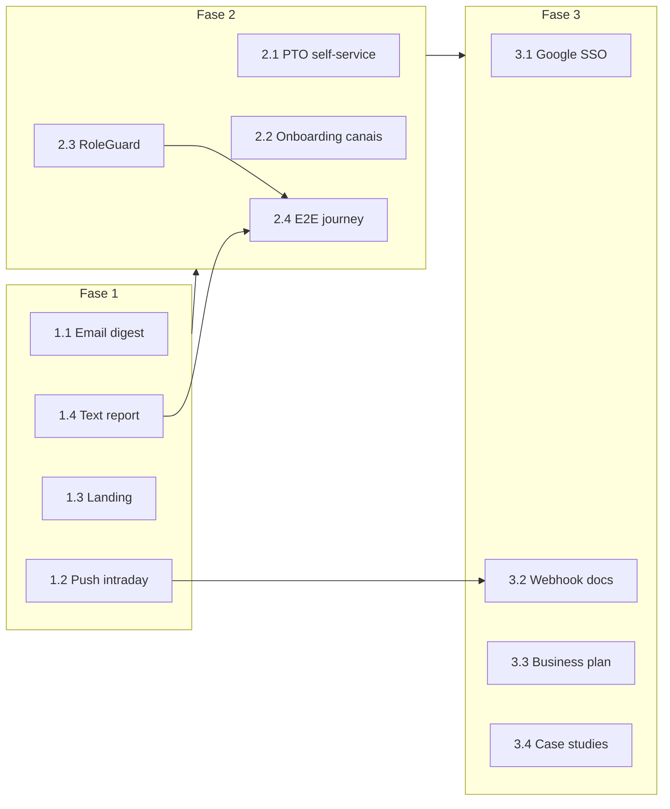

# Syntra Growth Roadmap — Plano de Implementação (Fases 1–3)

> **For agentic workers:** REQUIRED SUB-SKILL: Use superpowers:subagent-driven-development (recommended) ou superpowers:executing-plans para implementar task-by-task. Steps usam checkbox (`- [ ]`) para tracking.

**Goal:** Fechar o loop “quem sumiu” (alertas proativos + landing + relatório de texto), reduzir atrito operacional (PTO self-service, onboarding, RBAC UI, E2E) e expandir ticket/TAM (SSO Google, docs de integração, plano Business, case studies) — **sem breaking changes** e com testes em cada entrega.

**Architecture:** Todas as mudanças são **aditivas**: novos campos opcionais em schemas, novos endpoints, novos workers/crons, novos componentes UI. Defaults preservam comportamento atual (`notifyManagerEmail: false`, status `scheduled` em PTO existente, planos Starter/Team inalterados). Backend: services testados com Vitest antes de rotas; frontend: Karma por componente + Playwright E2E incremental. Extrair RBAC duplicado para `tenantRbac.ts` sem alterar respostas HTTP existentes.

**Tech Stack:** Node.js 22, Koa, Mongoose, Vitest, Supertest, Angular 21, Karma, Playwright, web-push, nodemailer (novo — email digest), Google OAuth 2.0 (Fase 3).

**Spec de referência:** [`docs/superpowers/specs/2026-06-20-pulsedesk-saas-design.md`](../specs/2026-06-20-pulsedesk-saas-design.md)

**Estado atual relevante (baseline):**
- Push semanal para gestores **já existe** em `inactivityCron.ts` quando `notifyManagerPush: true` e há membros `missing`.
- Campo `notifyManagerEmail` existe em `InactivitySettings` mas **não é disparado** em nenhum worker.
- Relatório intraday existe (`intradayInactivityService.ts`) mas **sem cron/push** associado.
- Seletor visual de canais **já existe** em `channels-settings.component` — onboarding só redireciona para settings.
- RBAC backend **parcial** (helpers duplicados por rota); frontend **sem** `RoleGuard`.
- Plano Business **não** está no seed (`seedPlans.ts` só Starter + Team).

**Princípios anti-breaking-change:**
1. Não renomear/remover campos JSON da API pública.
2. Novos status/enum values são adicionados, nunca removidos.
3. Novos query params e rotas; rotas antigas mantidas.
4. Feature flags via settings existentes (`notifyManagerEmail`, `Plan.features`).
5. Migrations MongoDB: apenas `$set` com defaults em documents existentes via script idempotente opcional.

---

## Mapa de arquivos (visão geral)

```
backend/src/
├── services/
│   ├── emailDigestService.ts          # NOVO — templates + envio
│   ├── pushService.ts                 # estender payloads intraday/weekly
│   ├── textCollaborationReportService.ts  # NOVO — agregação texto
│   ├── plannedAbsenceService.ts       # PTO self-service + aprovação
│   └── googleAuthService.ts           # NOVO Fase 3
├── workers/
│   ├── inactivityCron.ts              # wire notifyManagerEmail
│   ├── intradayInactivityCron.ts      # NOVO — push intraday
│   └── goalsProgressCron.ts           # NOVO — push quinta (meta < 50%)
├── api/
│   ├── middleware/tenantRbac.ts       # NOVO — centralizar RBAC
│   └── routes/
│       ├── textReports.ts             # NOVO
│       ├── me.ts                      # POST absence-request
│       └── absenceRequests.ts         # NOVO — aprovação gestor
frontend/src/app/
├── features/
│   ├── landing/                       # seções problema/como/privacidade
│   ├── reports/text-collaboration/    # NOVO
│   ├── onboarding/onboarding-channels-step.component.ts  # NOVO embed
│   ├── collaborator/me/               # solicitar PTO
│   └── marketing/case-studies/        # NOVO Fase 3
├── core/auth/role.guard.ts            # NOVO
docs/integrations/webhooks.md            # NOVO Fase 3
```

---

## Fase 1 — Fechar o loop “quem sumiu”

**Critério de conclusão:** Gestor recebe email semanal (opt-in) + push intraday em novos alertas; landing comunica valor; aba “Sinais de texto” no hub de relatórios; `npm test` verde em backend e frontend.

---

### Task 1.1: Email digest semanal para gestores

**Contexto:** `notifyManagersAboutMissingMembers` (push) já roda no cron semanal. Falta canal email quando `notifyManagerEmail: true`.

**Files:**
- Create: `backend/src/services/emailDigestService.ts`
- Create: `backend/tests/services/emailDigestService.test.ts`
- Modify: `backend/src/workers/inactivityCron.ts`
- Modify: `backend/src/config/env.ts` (vars SMTP opcionais)
- Modify: `.env.example`

- [ ] **Step 1: Write the failing test**

```typescript
// backend/tests/services/emailDigestService.test.ts
import { describe, expect, it, vi } from 'vitest';
import { buildWeeklyInactivityDigest, sendWeeklyInactivityDigest } from '../../src/services/emailDigestService';

describe('buildWeeklyInactivityDigest', () => {
  it('monta assunto e corpo em pt-BR com contagem de sumidos', () => {
    const digest = buildWeeklyInactivityDigest({
      organizationName: 'Acme',
      guildName: 'Time Dev',
      missingMembers: [
        { displayName: 'Ana', inactiveBusinessDays: 3 },
        { displayName: 'Bruno', inactiveBusinessDays: 2 },
      ],
      periodEnd: new Date('2026-06-20T12:00:00Z'),
    });
    expect(digest.subject).toContain('2');
    expect(digest.subject).toMatch(/sumiu/i);
    expect(digest.textBody).toContain('Ana');
    expect(digest.textBody).not.toContain('produtiv'); // terminologia
  });
});

describe('sendWeeklyInactivityDigest', () => {
  it('retorna disabled quando SMTP não configurado', async () => {
    const result = await sendWeeklyInactivityDigest({
      to: ['gestor@acme.com'],
      digest: buildWeeklyInactivityDigest({
        organizationName: 'Acme',
        guildName: 'Guild',
        missingMembers: [],
        periodEnd: new Date(),
      }),
      transport: undefined,
    });
    expect(result.disabled).toBe(true);
    expect(result.sent).toBe(0);
  });
});
```

- [ ] **Step 2: Run test — expect FAIL**

```bash
wsl npm run test --workspace=backend -- tests/services/emailDigestService.test.ts
```

- [ ] **Step 3: Implement `emailDigestService.ts`**

Responsabilidades:
- `buildWeeklyInactivityDigest(input)` → `{ subject, textBody, htmlBody }`
- `listManagerEmails(organizationId)` — reutilizar query de `pushService.listManagerIds` + join `PlatformUser.email`
- `sendWeeklyInactivityDigest({ to, digest, transport? })` — injetar transport para testes; produção usa nodemailer só se `SMTP_HOST` definido
- Terminologia: **colaboração**, **quem sumiu**, nunca “produtividade”

- [ ] **Step 4: Wire em `inactivityCron.ts`** (após bloco push existente):

```typescript
if (settings.notifyManagerEmail && missingMembers.length > 0) {
  await sendWeeklyInactivityDigestToManagers({
    organizationId,
    guildId,
    missingMembers,
    periodEnd: snapshot.periodEnd,
  });
}
```

- [ ] **Step 5: Extend `backend/tests/workers/inactivityCron.test.ts`** — mock `sendWeeklyInactivityDigestToManagers`, assert chamado quando `notifyManagerEmail: true`.

- [ ] **Step 6: Run full backend tests**

```bash
wsl npm run test --workspace=backend
```

---

### Task 1.2: Push intraday quando alguém não apareceu

**Contexto:** `getIntradayInactivityReport` classifica `not_started` e `low_collaboration_today` em `concernEntries`. Precisa cron com deduplicação para não spammar.

**Files:**
- Create: `backend/src/workers/intradayInactivityCron.ts`
- Create: `backend/tests/workers/intradayInactivityCron.test.ts`
- Modify: `backend/src/services/pushService.ts`
- Modify: `backend/src/index.ts` (start worker)
- Modify: `backend/src/db/models/InactivitySettings.ts` (opcional: `notifyIntradayPush: boolean`, default `true`)

- [ ] **Step 1: Write failing test for push payload**

```typescript
// backend/tests/services/pushService.test.ts (adicionar describe)
it('envia push intraday com nomes dos colaboradores em alerta', async () => {
  // mock webPush + subscriptions como testes existentes
  const result = await notifyManagersAboutIntradayConcerns({
    organizationId: orgId,
    guildId: 'g1',
    concernEntries: [
      { discordId: '1', displayName: 'Ana', status: 'not_started' },
    ],
  });
  expect(result.sent).toBeGreaterThanOrEqual(0);
});
```

- [ ] **Step 2: Implement `notifyManagersAboutIntradayConcerns` em `pushService.ts`**

Payload sugerido:
```json
{
  "title": "Syntra - Alerta de hoje",
  "body": "Ana ainda não apareceu na colaboração hoje.",
  "type": "intraday_inactivity",
  "guildId": "...",
  "concernCount": 1
}
```

- [ ] **Step 3: Implement cron**

Algoritmo (`intradayInactivityCron.ts`):
1. A cada **15 min** (configurável), para cada org/guild em dia útil + dentro da janela de trabalho (reusar `getElapsedWorkWindowMetrics`).
2. Chamar `getIntradayInactivityReport(organizationId, guildId)`.
3. Filtrar `concernEntries` com status `not_started` | `low_collaboration_today`.
4. Deduplicar via collection **`IntradayAlertDispatch`** (nova, leve) ou Map em memória + persistência: chave `{ orgId, guildId, trackedUserId, localDate, status }`.
5. Se `notifyManagerPush` (ou novo `notifyIntradayPush`) → push.
6. Enfileirar webhook `member.intraday_concern.detected` (novo event type **aditivo** em `OutboundWebhookEvent`).

- [ ] **Step 4: Testes do cron** com mocks de timezone e dedupe.

- [ ] **Step 5: Toggle na UI** `inactivity-settings.component` — checkbox “Alertas push durante o dia” (default ligado).

---

### Task 1.3: Landing — problema → como funciona → privacidade → pricing

**Files:**
- Create: `frontend/src/app/features/landing/problem-section/problem-section.component.ts`
- Create: `frontend/src/app/features/landing/how-it-works-section/how-it-works-section.component.ts`
- Create: `frontend/src/app/features/landing/privacy-section/privacy-section.component.ts`
- Modify: `frontend/src/app/features/landing/landing-page.component.html`
- Modify: `frontend/src/app/features/landing/landing-page.component.ts`
- Create: `frontend/src/app/features/landing/landing-page.component.spec.ts` (expandir)
- Modify: `frontend/e2e/inactivity.spec.ts`

- [ ] **Step 1: Write failing Karma test**

```typescript
// landing-page.component.spec.ts
it('renderiza seções problema, como funciona e privacidade', () => {
  const compiled = fixture.nativeElement as HTMLElement;
  expect(compiled.querySelector('[data-testid="landing-problem"]')).toBeTruthy();
  expect(compiled.querySelector('[data-testid="landing-how"]')).toBeTruthy();
  expect(compiled.querySelector('[data-testid="landing-privacy"]')).toBeTruthy();
});
```

- [ ] **Step 2: Implementar 3 componentes standalone** com copy alinhado ao spec:
  - **Problema:** “Você só descobre na sexta que alguém sumiu na terça”
  - **Como funciona:** 3 passos — conectar Discord → configurar canais/calendário → receber alertas
  - **Privacidade:** metadados only; portal `/me`; sem gravação

- [ ] **Step 3: Manter `<app-pricing-section />` por último** — ordem: hero → problema → como → privacidade → pricing → CTA

- [ ] **Step 4: Playwright**

```typescript
test('landing exibe blocos de valor', async ({ page }) => {
  await page.goto('/landing');
  await expect(page.getByTestId('landing-problem')).toBeVisible();
  await expect(page.getByTestId('landing-privacy')).toContainText(/metadados/i);
});
```

---

### Task 1.4: Relatório de texto colaborativo (simples)

**Files:**
- Create: `backend/src/services/textCollaborationReportService.ts`
- Create: `backend/tests/services/textCollaborationReportService.test.ts`
- Create: `backend/src/api/routes/textReports.ts`
- Modify: `backend/src/api/server.ts` (mount router)
- Create: `frontend/src/app/features/reports/text-collaboration/text-collaboration-report.component.ts`
- Modify: `frontend/src/app/features/reports/reports-hub.component.ts`
- Modify: `frontend/src/app/app.routes.ts`

- [ ] **Step 1: Failing service test**

```typescript
it('agrega contagem de eventos por membro no período', async () => {
  // seed TextActivityEvent + TrackedUser em mongodb-memory-server
  const report = await getTextCollaborationReport({
    organizationId,
    guildId,
    from: new Date('2026-06-01'),
    to: new Date('2026-06-07'),
  });
  expect(report.entries[0]).toMatchObject({
    displayName: expect.any(String),
    eventCount: expect.any(Number),
    lastTextActivityAt: expect.any(Date),
  });
});
```

- [ ] **Step 2: Implementar service** — agregação MongoDB:
  - `$match` tenant + guild + `occurredAt` range
  - `$group` por `discordId`: count, max(occurredAt)
  - join `TrackedUser` para displayName/category
  - **Nunca** retornar conteúdo de mensagem

- [ ] **Step 3: Rota GET** `/org/:orgId/guilds/:guildId/reports/text-collaboration?from=&to=`
  - Leitura: `VIEWER_ROLES` (mesmo padrão de `inactivity.ts`)
  - OpenAPI tag `Reports`

- [ ] **Step 4: UI** — tabela simples: nome, eventos no período, último sinal; filtro semana atual; link no hub:

```typescript
{ label: 'Sinais de texto', path: 'text', description: 'Atividade em canais de trabalho (metadados)' }
```

- [ ] **Step 5: API route test** em `backend/tests/api/` + component spec Karma.

---

### Task 1.5: Verificação Fase 1

- [ ] `wsl npm run test --workspace=backend`
- [ ] `wsl npm run test --workspace=frontend`
- [ ] `wsl npm run test:e2e --workspace=frontend`
- [ ] Manual: habilitar `notifyManagerEmail` em settings → simular cron com data mockada → verificar log/envio.

---

## Fase 2 — Reduzir atrito operacional

**Critério de conclusão:** Colaborador solicita PTO em `/me`; gestor aprova; onboarding embeda seletor de canais; viewer não acessa settings de escrita; E2E cobre signup → onboarding → dashboard com alerta mockado.

---

### Task 2.1: PTO self-service (solicitar → aprovar)

**Design sem breaking change:**
- Adicionar status `pending_approval` ao enum `PlannedAbsenceStatus` (valor novo).
- Ausências criadas por gestor continuam `scheduled` direto (fluxo atual).
- Colaborador via `/me` cria com `pending_approval`.
- Campos opcionais novos: `approvedBy?: ObjectId`, `approvedAt?: Date`, `requestedBy?: ObjectId`.

**Files:**
- Modify: `backend/src/db/models/PlannedAbsence.ts`
- Modify: `backend/src/services/plannedAbsenceService.ts`
- Create: `backend/tests/services/plannedAbsenceApproval.test.ts`
- Modify: `backend/src/api/routes/me.ts`
- Create: `backend/src/api/routes/absenceRequests.ts`
- Modify: `backend/src/api/server.ts`
- Modify: `frontend/src/app/features/collaborator/me/me-portal.component.ts`
- Create: `frontend/src/app/features/settings/absences/absence-requests.component.ts` (fila gestor)

- [ ] **Step 1: Failing test — create request**

```typescript
it('colaborador cria ausência pending_approval', async () => {
  const absence = await createAbsenceRequest({
    organizationId, guildId, trackedUserId, discordId,
    type: 'pto', startDate, endDate, requestedBy: userId,
  });
  expect(absence.status).toBe('pending_approval');
});
```

- [ ] **Step 2: `approveAbsenceRequest(id, approvedBy)`** → status `scheduled` (cron existente promove para `active`).

- [ ] **Step 3: Rotas**
  - `POST /api/v1/me/absence-requests` — colaborador (vinculado a TrackedUser)
  - `GET /api/v1/org/:orgId/guilds/:guildId/absence-requests?status=pending_approval` — manager+
  - `POST .../absence-requests/:id/approve` — manager+
  - `POST .../absence-requests/:id/reject` — manager+ → `cancelled`

- [ ] **Step 4: UI `/me`** — formulário simples (tipo, datas, nota) + lista de solicitações pendentes.

- [ ] **Step 5: UI gestor** — badge na settings absences ou aba “Solicitações pendentes”.

- [ ] **Step 6: `isOnPlannedAbsence`** — incluir `pending_approval` **apenas após aprovação** (scheduled/active). Pendentes **não** excluem inatividade ainda (gestor precisa aprovar).

---

### Task 2.2: Seletor visual de canais no onboarding (passo 4)

**Contexto:** `ChannelsSettingsComponent` já implementa tabela com checkboxes. Evitar duplicação.

**Files:**
- Create: `frontend/src/app/features/onboarding/onboarding-channels-panel.component.ts`
- Modify: `frontend/src/app/features/onboarding/onboarding-wizard.component.html`
- Modify: `channels-settings.component.ts` — extrair lógica para `ChannelRulesFacadeService` (opcional) ou importar componente com `@Input() compactMode`

- [ ] **Step 1: Refatorar `ChannelsSettingsComponent`** — adicionar `@Input() embedded = false` que oculta header/breadcrumb quando true.

- [ ] **Step 2: Embed no wizard passo 4** abaixo da descrição, sem sair da página.

- [ ] **Step 3: Ao salvar com sucesso no embed** — auto-marcar step 4 completo via `OnboardingService.markStepComplete(4)`.

- [ ] **Step 4: Karma** — wizard mostra painel de canais quando `currentStep === 4`.

---

### Task 2.3: RoleGuard + política de visibilidade Viewer

**Files:**
- Create: `backend/src/api/middleware/tenantRbac.ts`
- Create: `backend/tests/api/middleware/tenantRbac.test.ts`
- Create: `frontend/src/app/core/auth/role.guard.ts`
- Create: `frontend/src/app/core/auth/role.guard.spec.ts`
- Modify: `frontend/src/app/app.routes.ts`
- Modify: `frontend/src/app/core/auth/auth.service.ts` — `getMembershipRole(): MembershipRole | null`
- Modify: `backend/src/db/models/Organization.ts` — `settings.viewerCanSeeIndividualReports: boolean` (default `false`)

**Matriz UI (MVP):**

| Rota | viewer |
|------|--------|
| `/app/dashboard`, `/app/live`, relatórios leitura | ✅ |
| `/app/settings/*` | ❌ redirect `/app/dashboard` |
| `/app/reports/*` individuais | ⚙️ `viewerCanSeeIndividualReports` |
| Export CSV | ❌ |

- [ ] **Step 1: `tenantRbac.ts`** — export `assertManagerRole(ctx, orgId)`, `assertViewerReadRole`, `getMembershipRole` — migrar **uma** rota piloto (`goals.ts`) e testar.

- [ ] **Step 2: `roleGuard` Angular**

```typescript
export const managerGuard: CanActivateFn = () => {
  const role = inject(AuthService).getMembershipRole();
  return ['owner', 'admin', 'manager'].includes(role ?? '') ? true : inject(Router).createUrlTree(['/app/dashboard']);
};
```

- [ ] **Step 3: Aplicar `managerGuard` em rotas `settings/*`** e ações de escrita.

- [ ] **Step 4: Backend** — quando `viewerCanSeeIndividualReports === false`, relatórios individuais retornam apenas agregados (ou 403 em endpoints com PII — espelhar lógica de `gamificationRankingService.filterByVisibility`).

- [ ] **Step 5: Settings toggle** em nova seção “Permissões” ou dentro de inatividade — apenas owner/admin.

---

### Task 2.4: E2E signup → onboarding → primeiro alerta

**Files:**
- Create: `frontend/e2e/helpers/test-org.fixture.ts`
- Create: `frontend/e2e/journey-quem-sumiu.spec.ts`
- Modify: `frontend/playwright.config.ts` — `webServer` apontando backend+frontend se não existir

**Estratégia sem Discord real:**
- Usar API de teste / seed (`backend/tests/fixtures`) ou intercept Playwright `page.route` para mockar:
  - `GET .../onboarding/progress`
  - `GET .../reports/inactivity/intraday` → `concernEntries: [{ displayName: 'Dev Test', status: 'not_started' }]`

- [ ] **Step 1: Fixture registra usuário via `POST /api/v1/auth/register`**

- [ ] **Step 2: Login UI → completa onboarding (mock guild configurado)**

- [ ] **Step 3: Assert dashboard mostra “quem sumiu hoje” com nome mockado**

- [ ] **Step 4: Documentar no spec E2E que requer `npm run dev:backend` ou docker compose**

---

### Task 2.5: Verificação Fase 2

- [ ] Backend + frontend tests
- [ ] E2E journey passando no CI (job opcional `e2e` em `.github/workflows/ci.yml`)

---

## Fase 3 — Crescer ticket e TAM

**Critério de conclusão:** Login Google opcional; docs webhooks com exemplos n8n; plano Business na landing via API; 3 case studies publicados.

---

### Task 3.1: SSO Google Workspace

**Design sem breaking change:** Login email/senha permanece. Google é **login adicional**; conta linkada por email matching ou fluxo explícito de link.

**Files:**
- Create: `backend/src/services/googleAuthService.ts`
- Create: `backend/src/api/routes/googleAuth.ts`
- Modify: `backend/src/db/models/PlatformUser.ts` — `googleId?: string` (sparse index)
- Modify: `frontend/src/app/features/auth/login/login.component.ts`
- Create: `backend/tests/api/googleAuthRoutes.test.ts`

**Env novos (opcionais):** `GOOGLE_CLIENT_ID`, `GOOGLE_CLIENT_SECRET`, `GOOGLE_REDIRECT_URI`

- [ ] **Step 1: Test — callback válido cria sessão JWT**

- [ ] **Step 2: `GET /auth/google` redirect + `GET /auth/google/callback`**

- [ ] **Step 3: Se email já existe em PlatformUser → associa `googleId`**; senão cria org trial padrão (mesmo fluxo register).

- [ ] **Step 4: Botão “Entrar com Google”** na login/signup apenas se `GET /public/config` retornar `googleAuthEnabled: true`.

---

### Task 3.2: Documentação de integrações webhook

**Files:**
- Create: `docs/integrations/webhooks.md`
- Create: `docs/integrations/examples/n8n-inactivity-slack.json`
- Modify: `README.md` — link para docs

Conteúdo obrigatório:
- Eventos: `member.inactivity.detected`, `member.intraday_concern.detected` (Fase 1)
- Headers `X-Syntra-Signature`, verificação HMAC
- Exemplo curl + n8n → Slack webhook interno do gestor
- Exemplo Notion database (campos sugeridos)

- [ ] **Step 1: Test de contrato** — `backend/tests/services/webhookService.test.ts` já valida HMAC; adicionar snapshot do payload documentado.

---

### Task 3.3: Plano Business + export/API na landing

**Files:**
- Modify: `backend/src/scripts/seedPlans.ts`
- Modify: `frontend/src/app/features/landing/pricing-section/pricing-section.component.ts`
- Create: `frontend/src/app/core/pricing/public-pricing.service.ts`
- Modify: `backend/tests/api/publicRoutes.test.ts`

**Plano Business (aditivo ao seed):**

```typescript
{
  name: 'Business',
  slug: 'business',
  priceCents: 29900,
  limits: { maxGuilds: 3, maxTrackedMembers: 200, dataRetentionDays: 365 },
  features: {
    gamification: true, ranking: true, exportCsv: true,
    apiAccess: true, webhooks: true, advancedReports: true,
  },
  isPublic: true,
  sortOrder: 3,
}
```

- [ ] **Step 1: Seed test** — `seedPlansCatalog` upsert 3 planos.

- [ ] **Step 2: Pricing section consome `GET /api/v1/pricing`** em vez de array hardcoded (fallback local se API falhar — **sem breaking** na UX).

- [ ] **Step 3: Destacar Business** — “Export CSV + API + Webhooks”.

- [ ] **Step 4: Enforcement** — verificar `Plan.features.apiAccess` e `webhooks` nas rotas existentes (já parcial; completar testes).

---

### Task 3.4: Case studies (marketing)

**Files:**
- Create: `frontend/src/app/features/marketing/case-studies/case-studies.data.ts`
- Create: `frontend/src/app/features/marketing/case-studies/case-study-page.component.ts`
- Modify: `frontend/src/app/app.routes.ts` — `/case-studies/:slug` (público)
- Modify: landing — link “Ver cases”

**3 cases (conteúdo estático MVP):**
1. Dev shop remota (15 devs, Discord, redução de 1:1 reativos)
2. Comunidade B2B / suporte (turnos, quem sumiu no plantão)
3. Agência dev (metas individuais + alertas sem Toggl)

- [ ] **Step 1: Karma** — rota pública renderiza case `dev-shop`
- [ ] **Step 2: SEO básico** — title por case

---

### Task 3.5: Verificação Fase 3 + regressão completa

```bash
wsl npm test
wsl npm run build
wsl npm run test:e2e --workspace=frontend
```

---

## Ordem de execução e dependências



**Paralelizável dentro da Fase 1:** Tasks 1.3 (landing) e 1.4 (text report) independentes de 1.1/1.2.

---

## Checklist de qualidade (todas as fases)

- [ ] JSDoc em todo export novo (backend)
- [ ] Bloco `@openapi` em rotas novas
- [ ] Terminologia UI: colaboração, quem sumiu — nunca produtividade
- [ ] Queries com `organizationId` (multitenant)
- [ ] Testes unitários + integração API para backend
- [ ] Karma para componentes Angular novos
- [ ] Nenhuma remoção de campo/rota pública
- [ ] `.env.example` atualizado com vars opcionais documentadas

---

## Estimativa rough (dev sênior, com testes)

| Fase | Escopo | Estimativa |
|------|--------|------------|
| 1 | 4 entregas | 1,5–2 semanas |
| 2 | 4 entregas | 2–2,5 semanas |
| 3 | 4 entregas | 2–3 semanas |
| **Total** | | **5,5–7,5 semanas** |

---

## Self-review (spec coverage)

| Requisito usuário | Task |
|-------------------|------|
| Email/push digest semanal | 1.1 (+ push já existente) |
| Alertas intraday push | 1.2 |
| Landing 3 blocos + pricing | 1.3 |
| Relatório texto | 1.4 |
| PTO self-service | 2.1 |
| Seletor canais onboarding | 2.2 |
| RoleGuard + viewer policy | 2.3 |
| E2E signup → alerta | 2.4 |
| SSO Google | 3.1 |
| Webhooks documentados | 3.2 |
| Business + export/API | 3.3 |
| Case studies | 3.4 |
| Sem breaking changes | Princípios + designs aditivos em cada task |
| Testes em tudo | Checklist + TDD por task |

**Gaps intencionais pós-plano (v1.2+):** sync Stripe ao editar plano admin, persistência histórica badges, multi-moeda, Slack/Teams.
