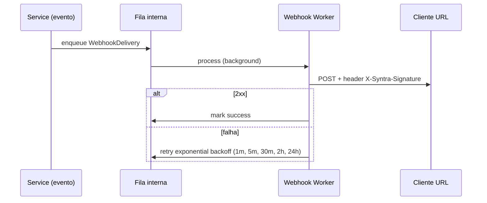

# Syntra — Design Spec: SaaS B2B para Times Remotos no Discord

**Data:** 2026-06-20  
**Revisão:** 2026-06-20 (v6 — calendário org, ausências PTO, sinais texto, mercado BRL)  
**Status:** Aguardando revisão  
**Nome comercial:** Syntra  
**Base:** discord-tracker v1.0.0 (bot de presença e voz)

---

## 1. Resumo executivo

Transformar o **discord-tracker** (monitoramento de presença e voz no Discord) em um produto **SaaS multitenant** focado em **empresas e times remotos** que usam Discord como canal de colaboração.

O produto oferece:

- Relatórios de jornada e **colaboração** para **gestores** — com foco em **quem sumiu**
- **Wizard de onboarding guiado** — time to value < 10 minutos
- **Metas individuais** por colaborador (categoria sugere padrão; meta é sempre por pessoa)
- **Relatório de inatividade** — core do produto (“quem desapareceu esta semana”)
- **Calendário de trabalho configurável** — jornada padrão, feriados BR e dias úteis por org
- **Gestão de ausências planejadas** — férias, PTO e licenças (excluem falsos positivos de inatividade)
- **Sinais de colaboração em texto** — metadados em canais de trabalho (sem conteúdo de mensagens)
- **Gamificação leve e opcional** (badges, streaks)
- **Ranking configurável pelo gestor** (escopo, métrica, período, privacidade)
- **Planos e preços configuráveis pelo Super Admin** (dono da plataforma)
- Billing via **Stripe**, auth via **Discord OAuth**, isolamento de dados por **organizationId**
- Arquitetura **monorepo**: `backend/` + `frontend/` (Angular 21 + TailAdmin)
- **PWA** responsiva com **push notifications** (sem app nativo Capacitor)
- **Performance** com SLOs definidos e **testes automatizados obrigatórios** em ambas as camadas
- **Swagger + JSDoc** completo na API; **webhooks outbound** assíncronos; **CI/CD** GitHub → deploy SSH
- Canais e categorias de membros configurados **100% via sistema** (nunca env)
- **Bot Discord e credenciais OAuth** cadastrados via UI (Super Admin / tenant) — env só para infraestrutura

### Proposta de valor

> Veja quem do seu time remoto **sumiu** — e acompanhe a **colaboração** no Discord com transparência, sem invadir a privacidade.

**North Star (motivo do produto):** responder *“Quem desapareceu esta semana?”* antes que vire problema de entrega, clima ou turnover.

**Tagline marketing:** *“Saiba quem está colaborando — e quem sumiu — no Discord do seu time.”*

---

## 2. Contexto do produto atual

### 2.1 O que já existe

| Capacidade | Implementação atual |
|------------|---------------------|
| Presença | ONLINE, IDLE, DND, OFFLINE, INVISIBLE |
| Voz | JOIN, LEAVE, SWITCH, AFK automático, reconexão |
| Tempo colaborativo | Sessões `VOICE` (exclui AFK, Almoço, canais ignorados) — exibido como **horas colaborativas** |
| Atividade texto | `TextActivityEvent` em canais colaborativos — **metadados only** |
| Calendário / PTO | `WorkCalendar` + `PlannedAbsence` — dias úteis e ausências |
| Relatórios | Diário, mensal, ranking por `productiveHours` |
| API REST | Koa, autenticação por API keys globais |
| Dashboard legado | EJS embarcado no backend (será removido) |
| Frontend (template) | **Angular 21 + TailAdmin** (`frontend/`, pacote `ng-tailadmin`) — ainda não integrado à API |
| Métricas | Prometheus |
| Recuperação | Sessões órfãs após reinício |
| Privacidade | Apenas metadados — **não** armazena mensagens |

### 2.2 Definição de "colaboração" (terminologia UI vs código)

**Regra de nomenclatura:** em **UI, marketing, emails e relatórios exportados** usar sempre **colaboração** / **horas colaborativas** — **nunca** “produtividade”.

| Contexto | Termo |
|----------|-------|
| UI / marketing / emails | colaboração, horas colaborativas, tempo em sync |
| Código interno / MongoDB | `productiveSeconds`, `sessionType: VOICE` (legado — não renomear no MVP) |
| API JSON pública | `collaborationHours`, `collaborationSeconds` (alias exposto; mapeia de `productiveSeconds`) |

**Tempo colaborativo (voz)** = tempo em canal de voz classificado como colaborativo (`sessionType: VOICE`), ou seja, fora de canais AFK, Almoço ou ignorados.

**Sinais de colaboração (MVP)** — três fontes passivas, **sem invasão**:

| Sinal | O que mede | Armazenado |
|-------|------------|------------|
| **Voz colaborativa** | Tempo em call de trabalho | `VoiceSession`, horas colaborativas |
| **Presença** | ONLINE / IDLE / DND | `PresenceSession`, `lastPresenceAt` |
| **Texto colaborativo** | Atividade em canais de texto de trabalho | `TextActivityEvent` — **só metadados** |

**Texto colaborativo (regra de privacidade):** o bot registra **apenas** `discordId`, `channelId`, `timestamp` e tipo de evento (`message`, `thread_reply`, `reaction`). **Nunca** persiste conteúdo, anexos, embeds, áudio ou transcrições. O bot **não entra** em salas de voz para ouvir conversas.

**Substituição do Toggl (escopo interno e vendas):** o Syntra substitui o **timer manual** para **visibilidade de colaboração** do time remoto no Discord. **Não** inclui alocação por cliente/projeto — apenas visibilidade agregada e por pessoa.

**Não inclui (fora do escopo MVP):**

- Atividade fora do Discord (IDE, Jira, etc.)
- Conteúdo de mensagens, gravação de voz ou tela compartilhada
- Alocação por cliente, projeto ou centro de custo
- Timesheet legal/fiscal
- Output/entregas (PRs, tickets fechados)

### 2.3 Lacunas para SaaS

| Aspecto atual | Necessidade |
|---------------|-------------|
| Instância single-tenant | Multitenant com `organizationId` |
| Bot/token Discord via `.env` | **Aplicativo Discord via UI** — credenciais criptografadas no banco |
| `DISCORD_GUILD_ID` via env | **Guild selecionado via UI** pelo tenant |
| API keys globais no `.env` | OAuth + JWT + **API keys por org via UI** |
| Config de canais via env | **Regras 100% via sistema (UI)** — nunca via env em produção |
| Sem categorização de membros | **Categorias/departamentos** configuráveis (Dev, Comercial, Suporte…) |
| Um guild monitorado | N guilds por organização (conforme plano) |
| Planos inexistentes | Catálogo dinâmico + Stripe |
| Ranking fixo | Configurável pelo gestor |
| Sem roles de plataforma | Super Admin, Owner, Admin, Manager, Viewer |
| Estrutura monorepo | Backend e frontend acoplados na raiz | `backend/` + `frontend/` separados |
| Dashboard EJS no backend | SPA Angular TailAdmin consumindo API REST |
| Testes só no backend | Testes obrigatórios backend **e** frontend com CI |
| Inatividade sem contexto de calendário | **WorkCalendar** + feriados BR + **PlannedAbsence** |
| Só voz como sinal | **TextActivityEvent** em canais de texto colaborativos |

---

## 3. Objetivos e não-objetivos

### 3.1 Objetivos (MVP)

1. Permitir que empresas se cadastrem, conectem servidor Discord e vejam relatórios de colaboração
2. Isolar dados entre clientes (tenants) de forma segura
3. Oferecer planos com limites e features controlados pelo Super Admin
4. Permitir que gestores configurem gamificação e ranking conforme cultura do time
5. Cobrar assinatura recorrente via Stripe
6. Separar backend (`backend/`) e frontend Angular TailAdmin (`frontend/`) em monorepo
7. Garantir performance e cobertura de testes automatizados em ambas as camadas
8. Documentar API com JSDoc + Swagger; expor webhooks outbound para integrações
9. Entregar frontend **100% responsivo** + **PWA** com push notifications
10. **Relatório de inatividade** (“quem sumiu”) como feature central do MVP vendável
11. **Metas individuais** por colaborador (não metas agregadas de equipe)
12. **Calendário de trabalho** configurável (jornada + feriados BR + dias úteis) integrado à inatividade
13. **Ausências planejadas** (férias/PTO) com CRUD gestor e exclusão automática de alertas
14. **Sinais de texto colaborativo** (metadados only) complementando voz e presença

### 3.2 Não-objetivos (MVP)

- Modo gaming/comunidades como vertical principal
- SSO enterprise (Azure AD, Google Workspace)
- App nativo Capacitor / lojas App Store / Play Store
- Integrações Slack/Jira/Calendar
- Bot dedicado por cliente (fase Enterprise posterior)
- Leitura de mensagens ou conteúdo de conversas
- Timesheet com validade legal trabalhista
- **Metas agregadas de equipe** (ex.: “40h semanais pro time”) — só metas **por usuário**
- **Alocação por cliente/projeto** — produto é visibilidade de colaboração, não billing

### 3.3 MVP vendável vs v1.1 (corte de escopo)

| MVP vendável (~5 semanas) | v1.1+ |
|---------------------------|-------|
| Onboarding wizard completo (8 passos) | Super Admin CRUD planos dinâmico (seed fixo no MVP) |
| Bot + guild + canais **voz e texto** + categorias via UI | Webhooks outbound |
| Relatórios colaboração + **inatividade** | Gamificação badges/streaks |
| **Calendário de trabalho** + feriados BR seed | Feriados municipais importados (API) |
| **Ausências planejadas** (férias/PTO) | Colaborador solicita PTO self-service |
| **Sinais texto colaborativo** (metadados) | Atividade em fóruns/threads avançada |
| Metas individuais por usuário | Ranking configurável avançado |
| PWA + push notifications | Import categorias via Discord Roles |
| Stripe trial + 2 planos seed (**BRL only**) | Multi-moeda USD/EUR |
| Portal colaborador (só próprios dados) | SSO enterprise |

### 3.4 Posicionamento competitivo

**O que o Syntra é:**

> Analytics de **colaboração e presença** para times que usam Discord como escritório virtual — com foco em detectar **quem sumiu**.

**O que o Syntra NÃO é:**

- ❌ Espionagem de tela ou keystrokes (Hubstaff, Time Doctor)
- ❌ Time tracker manual (Toggl, Clockify)
- ❌ Substituto de Jira/Linear para medir entregas
- ❌ Bot de moderação ou logs de mensagens

| Alternativa | Limitação | Vantagem Syntra |
|-------------|-----------|-----------------|
| Planilha / feeling do gestor | Subjetivo, tardio | Dados automáticos, alertas de sumiço |
| Discord nativo | Sem relatórios de jornada/colaboração | Relatórios + inatividade + categorias |
| Toggl / Clockify | Depende do dev marcar tempo; foco em projetos | Passivo, visibilidade no Discord — **sem timer manual** |
| Hubstaff / monitoring | Invasivo, resistência do time | Só metadados (voz, presença, texto — **sem conteúdo**) |
| Slack analytics | Poucas empresas usam Slack como office | Discord-first |

**ICP (cliente ideal):** startups e scale-ups **10–80 pessoas**, remote-first ou híbridas, Discord como canal principal de trabalho — **mercado inicial Brasil** (BRL, LGPD como moat).

**Mercado e moeda (MVP):** billing e landing **somente BRL**. Expansão LATAM/global (USD/EUR) fica para v1.1+.

**Objeções comuns:**

| Objeção | Resposta |
|---------|----------|
| “É vigilância?” | Só metadados; sem conteúdo de mensagens; sem áudio; colaborador vê os próprios dados |
| “Horas em call ≠ trabalho” | Medimos **colaboração** (voz + presença + texto), não output — complementa 1:1 |
| “Marcou férias e apareceu como sumido” | **Ausências planejadas** + **feriados BR** excluem da inatividade automaticamente |

---

## 4. Personas e papéis

### 4.1 Personas

| Persona | Objetivo |
|---------|----------|
| **Super Admin** (dono da plataforma) | Gerenciar planos, preços, features, monitorar saúde da plataforma |
| **Owner** (cliente) | Criar organização, billing, convidar admins, conectar bot |
| **Admin** (cliente) | Configurar servidores, canais, usuários da plataforma |
| **Manager** (cliente) | Ver relatórios, **quem sumiu**, metas individuais, exportar |
| **Viewer** (cliente) | Somente leitura agregada (sem dados individuais sensíveis, se configurado) |
| **Membro rastreado** | Ver **próprio** resumo de colaboração; consentimento e transparência |

### 4.2 Matriz RBAC (MVP)

| Ação | Super Admin | Owner | Admin | Manager | Viewer |
|------|:-----------:|:-----:|:-----:|:-------:|:------:|
| CRUD planos (catálogo) | ✅ | — | — | — | — |
| Billing / trocar plano | — | ✅ | — | — | — |
| Conectar/desconectar bot | — | ✅ | ✅ | — | — |
| Config canais (AFK, almoço, voz e **texto**) | — | ✅ | ✅ | ✅ | — |
| Config **calendário de trabalho** | — | ✅ | ✅ | ✅ | — |
| CRUD **ausências planejadas** (férias/PTO) | — | ✅ | ✅ | ✅ | — |
| Ver relatório **quem sumiu** | — | ✅ | ✅ | ✅ | — |
| Config metas individuais | — | ✅ | ✅ | ✅ | — |
| Config gamificação/ranking | — | ✅ | ✅ | ✅ | — |
| Ver relatórios individuais | — | ✅ | ✅ | ✅ | ⚙️ |
| Ver relatórios agregados | — | ✅ | ✅ | ✅ | ✅ |
| Export CSV | — | ✅ | ✅ | ✅ | — |
| Convidar usuários plataforma | — | ✅ | ✅ | — | — |
| API keys da org | — | ✅ | ✅ | — | — |

⚙️ = configurável por política da organização (fase 2; MVP Viewer vê apenas agregados).

### 4.3 Wizard de onboarding guiado

**Objetivo:** Time to First Value **< 10 minutos** — do signup ao primeiro relatório útil (mesmo com dados parciais).

**Estado persistido:** `Organization.onboarding` (ver seção 6.16).

```
/onboarding
  Step 1/8  Conta criada ✓
  Step 2/8  Conectar bot Discord        → /settings/discord
  Step 3/8  Escolher servidor           → guild picker
  Step 4/8  Configurar canais           → voz (AFK, almoço, colaborativos) + **texto colaborativo**
  Step 5/8  Calendário de trabalho      → jornada seg–sex + feriados BR (preset)
  Step 6/8  Categorias do time          → seeds Dev/Comercial/Suporte/Marketing
  Step 7/8  Atribuir membros            → bulk assign ou “fazer depois”
  Step 8/8  Pronto!                     → dashboard com checklist pós-setup
```

**Comportamento:**

| Regra | Detalhe |
|-------|---------|
| Bloqueio soft | Dashboard acessível, banner “Complete o setup (5/8)” até step 5 mínimo (canais + calendário) |
| Skip permitido | Steps 6–7 podem ser “Configurar depois” |
| Preset calendário | Botão “Usar jornada BR padrão” — seg–sex 09:00–18:00 + feriados nacionais seed |
| Preset canais | Botão “Usar preset escritório virtual” — sugere AFK/Almoço comuns |
| Progress bar | Header global `%` até `onboarding.completedAt` |
| Empty states | Cada tela explica o que virá quando o time usar o Discord |
| Primeiro valor | Após step 3, live stats já visíveis (mesmo zerado) |

**Critério de sucesso onboarding:** org com bot conectado + ≥1 canal colaborativo (voz ou texto) + calendário configurado + ≥1 membro rastreado.

---

## 5. Arquitetura

### 5.1 Visão geral

```
┌─────────────────────────────────────────────────────────────────┐
│                        Clientes                                  │
│  Dashboard Web (Angular)  │  API REST  │  Discord Bot (shared)  │
└───────────────┬─────────────────────┬───────────────────────────┘
                │                     │
┌───────────────▼─────────────────────▼───────────────────────────┐
│                      Camada de aplicação                         │
│  Auth Service │ Tenant Service │ Report Service │ Gamification    │
│  Billing Service │ Plan Service │ Bot Event Router               │
└───────────────┬───────────────────────────────────────────────────┘
                │
┌───────────────▼───────────────────────────────────────────────────┐
│  MongoDB (organizationId em todas as collections)                │
│  Redis (cache de sessão, rate limit, filas leves — fase 2)       │
└───────────────────────────────────────────────────────────────────┘
                │
┌───────────────▼───────────────────────────────────────────────────┐
│  Stripe (Products/Prices sync, Subscriptions, Webhooks)          │
└───────────────────────────────────────────────────────────────────┘
```

### 5.2 Estratégia do bot Discord — configuração via UI

**Princípio:** credenciais Discord (`Client ID`, `Client Secret`, `Bot Token`) e servidor monitorado **nunca dependem de ENV em produção**. Tudo é cadastrado, validado e gerenciado pela plataforma via UI, persistido criptografado no MongoDB.

#### Níveis de configuração

| Nível | Quem configura | O quê | Onde na UI |
|-------|----------------|-------|------------|
| **Plataforma** | Super Admin | Aplicativo Discord padrão (bot compartilhado) | `/admin/discord` |
| **Plataforma** | Super Admin | URL pública, CORS, timezone default | `/admin/platform` |
| **Tenant** | Owner/Admin | Instalar bot no servidor (OAuth) | `/settings/discord` |
| **Tenant** | Owner/Admin | Escolher qual guild monitorar | `/settings/discord` |
| **Tenant** | Admin (Business+) | Bot próprio (BYOB — opcional) | `/settings/discord/advanced` |

#### Fluxo Super Admin — registrar bot da plataforma

1. Super Admin acessa `/admin/discord` → "Adicionar aplicativo Discord"
2. Informa: nome, **Client ID**, **Client Secret**, **Bot Token**
3. Backend valida credenciais (`GET /users/@me` na API Discord)
4. Secrets criptografados com `ENCRYPTION_KEY` (única env de infra) → salva `DiscordApplication`
5. `BotManager` reconecta o client Discord.js com o novo token (hot reload)
6. Status exibido: conectado ✅, username do bot, guilds count

#### Fluxo tenant — conectar servidor

1. Owner faz signup / login (OAuth usuário — usa Client ID da plataforma)
2. Acessa `/settings/discord` → "Conectar ao Discord"
3. Redirect OAuth2 **bot install** (`scope=bot` + `permissions=...`)
4. Seleciona servidor → bot entra no guild
5. Plataforma registra `GuildConnection` (`organizationId` + `guildId`)
6. Owner escolhe guild ativo se tiver múltiplos (conforme plano)
7. Eventos do bot filtram por `guildId → organizationId`

#### BotManager (backend)

```typescript
// Pseudocódigo — carrega credenciais do banco, não do env
class BotManager {
  async initialize(): Promise<void> {
    const app = await discordApplicationRepository.findPlatformDefault();
    if (!app) throw new PlatformNotConfiguredError('Registre o bot em /admin/discord');
    const token = decrypt(app.botTokenEncrypted);
    await this.connect(token);
  }
  async reloadFromDatabase(): Promise<void> { /* após PUT admin/discord */ }
}
```

**Enterprise / BYOB (Fase 2):** organização Business+ pode registrar `DiscordApplication` com `organizationId` — bot dedicado ao tenant.

#### O que NÃO vai mais em ENV (produção)

| Variável legada | Substituído por |
|-----------------|-----------------|
| `DISCORD_TOKEN` | `DiscordApplication.botTokenEncrypted` (UI Super Admin) |
| `DISCORD_CLIENT_ID` | `DiscordApplication.clientId` (UI) |
| `DISCORD_CLIENT_SECRET` | `DiscordApplication.clientSecretEncrypted` (UI) |
| `DISCORD_GUILD_ID` | `GuildConnection` + seleção UI tenant |
| `API_KEYS` | `ApiKey` por organização (UI) |
| `TIMEZONE` | `Organization.settings.timezone` (UI) |
| `IGNORED_CHANNELS` etc. | `ChannelRule` (UI) |

#### Bootstrap desenvolvimento (exceção local)

Para **dev local sem UI**, permitir seed opcional via script `npm run seed:discord-app` — **nunca** leitura direta de token em runtime via env em produção (`NODE_ENV=production` bloqueia fallback env).

### 5.3 Isolamento multitenant

**Regra inviolável:** toda query de leitura/escrita inclui `organizationId` derivado do JWT do usuário autenticado ou do contexto da API key.

Índices compostos obrigatórios, por exemplo:

- `{ organizationId: 1, guildId: 1, date: -1 }` em `daily_reports`
- `{ organizationId: 1, discordId: 1 }` em `tracked_users`

**Proibido:** endpoints que aceitam `organizationId` como parâmetro livre sem validar membership.

### 5.4 Política — configuração via UI vs ENV

Toda configuração **de negócio ou integração** é feita pela UI e persistida no banco. ENV reserva-se **apenas a infraestrutura** e secrets de bootstrap do servidor.

| Categoria | Via UI (banco) | Via ENV (infra) |
|-----------|:--------------:|:-----------------:|
| Bot Discord (token, client id/secret) | ✅ | ❌ prod |
| Servidor/guild monitorado | ✅ | ❌ |
| Canais AFK/almoço/ignorados + **texto colaborativo** | ✅ | ❌ |
| **Calendário de trabalho** + feriados | ✅ | ❌ |
| **Ausências planejadas** (PTO) | ✅ | ❌ |
| Categorias de membros | ✅ | ❌ |
| Timezone da org | ✅ | ❌ |
| API keys por tenant | ✅ | ❌ |
| Planos e preços | ✅ | ❌ |
| Webhooks outbound | ✅ | ❌ |
| Gamificação/ranking | ✅ | ❌ |
| MongoDB URI | ❌ | ✅ |
| JWT secret / encryption key | ❌ | ✅ |
| Stripe secret keys | ❌ | ✅ |
| PORT, NODE_ENV, LOG_LEVEL | ❌ | ✅ |

Frontend **não** embute `discordClientId` em `environment.ts` — obtém de `GET /api/v1/public/config` (Client ID é público; token nunca sai do backend).

### 5.5 Arquitetura monorepo — backend e frontend separados

O repositório adota **monorepo** com duas aplicações independentes:

```
discord-tracker/
├── backend/                 # API REST + Bot Discord (Node.js 22, Koa, Mongoose)
│   ├── src/
│   │   ├── api/             # Rotas HTTP, middlewares, auth
│   │   ├── bot/             # Cliente Discord, eventos, recovery
│   │   ├── config/
│   │   ├── db/
│   │   ├── repositories/
│   │   ├── services/
│   │   └── index.ts
│   ├── tests/               # Vitest — unit + integration + API
│   ├── package.json
│   ├── tsconfig.json
│   ├── vitest.config.ts
│   ├── Dockerfile
│   └── ecosystem.config.js
│
├── frontend/                # SPA Angular 21 + TailAdmin (ng-tailadmin)
│   ├── src/
│   │   ├── app/
│   │   │   ├── core/        # Auth, interceptors, guards, API clients
│   │   │   ├── features/    # Módulos Syntra (reports, ranking, admin…)
│   │   │   ├── shared/      # Componentes TailAdmin reutilizados
│   │   │   └── pages/       # Demo TailAdmin (remover o que não for usado)
│   │   └── environments/
│   ├── package.json
│   └── angular.json
│
├── docker-compose.yml       # mongodb + backend + frontend
├── package.json             # Scripts raiz (orquestração npm workspaces)
├── .env.example
└── docs/
```

| Camada | Stack | Responsabilidade |
|--------|-------|------------------|
| **Backend** | Node.js 25, TypeScript, Koa, Discord.js, Mongoose, Vitest | API REST, bot Discord, webhooks Stripe, agregações, auth JWT |
| **Frontend** | Angular 21, TailAdmin, Tailwind CSS 4, RxJS, Karma/Jasmine | UI gestor, Super Admin, landing, consumo da API via HTTP |

**Comunicação:** frontend → backend exclusivamente via **REST API JSON** (sem SSR compartilhado). CORS configurado no backend para origem do frontend.

**O que sai do backend na migração:**

- Pasta `src/dashboard/` (views EJS) — **removida**
- Dependências `ejs`, `koa-static` ligadas ao dashboard legado
- Script `copy-views` do build

### 5.6 Migração física do backend (Fase 0)

| Passo | Ação |
|-------|------|
| 1 | Criar pasta `backend/` |
| 2 | Mover `src/`, `tests/`, `tsconfig.json`, `vitest.config.ts`, `ecosystem.config.js`, `Dockerfile` para `backend/` |
| 3 | Ajustar paths internos e scripts `package.json` do backend |
| 4 | Criar `package.json` raiz com npm workspaces (`"workspaces": ["backend", "frontend"]`) |
| 5 | Atualizar `docker-compose.yml`: serviços `backend`, `frontend`, `mongodb` |
| 6 | Remover dashboard EJS; expor apenas API + `/health` + `/metrics` |
| 7 | Configurar proxy dev: Angular `ng serve` (:4200) → API (:3000) via `proxy.conf.json` |
| 8 | Atualizar README e CI para refletir estrutura dual |

**Critério de conclusão Fase 0:** `npm run test` passa no backend; `npm run build` passa no frontend; docker compose sobe os 3 serviços.

### 5.7 Migração do código existente (lógica)

| Módulo atual | Evolução |
|--------------|----------|
| `channelClassifier.ts` | Ler **exclusivamente** `ChannelRule` do banco por guild — **sem fallback env** |
| `guildService.ts` | Multi-guild; guild ativo via UI — **remover `DISCORD_GUILD_ID` env** |
| `config/env.ts` | Remover vars Discord/canais/API keys; manter só infra |
| `BotManager` (novo) | Carregar token de `DiscordApplication` no banco |
| `reportService.ts` | Filtrar agregações por `organizationId` |
| `auth.ts` (API keys) | JWT + API keys escopadas por org |
| Dashboard EJS | **Removido** — substituído pelo Angular TailAdmin em `frontend/` |
| Models Mongoose | Adicionar `organizationId`, renomear/refatorar conforme seção 6 |

---

## 6. Modelo de dados

### 6.1 Organization (tenant)

```typescript
interface Organization {
  _id: ObjectId;
  name: string;
  slug: string;                    // único, URL-friendly

  subscription: {
    planId: ObjectId;              // ref Plan
    stripeCustomerId: string;
    stripeSubscriptionId: string;
    status: 'trialing' | 'active' | 'past_due' | 'canceled' | 'unpaid';
    currentPeriodEnd: Date;
    trialEndsAt?: Date;
    grandfatheredPlanSnapshot?: PlanSnapshot;  // se plano foi alterado
  };

  settings: {
    timezone: string;              // default America/Sao_Paulo
    privacyPolicyAcceptedAt: Date;
    memberConsentBannerEnabled: boolean;
  };

  createdAt: Date;
  updatedAt: Date;
}
```

### 6.2 PlatformUser (usuários da plataforma — gestores/admins)

```typescript
interface PlatformUser {
  _id: ObjectId;
  discordId: string;               // único global
  email?: string;
  displayName: string;
  avatarUrl?: string;

  isSuperAdmin: boolean;           // true apenas para dono da plataforma

  memberships: Array<{
    organizationId: ObjectId;
    role: 'owner' | 'admin' | 'manager' | 'viewer';
    invitedAt: Date;
    acceptedAt?: Date;
  }>;

  createdAt: Date;
  updatedAt: Date;
}
```

### 6.3 Plan (catálogo — CRUD Super Admin)

```typescript
interface Plan {
  _id: ObjectId;
  name: string;                    // ex.: "Team"
  slug: string;                    // único, ex.: "team"
  description: string;

  priceCents: number;
  currency: string;                // "BRL"
  billingInterval: 'month' | 'year';

  limits: {
    maxGuilds: number;
    maxTrackedMembers: number;
    dataRetentionDays: number;
  };

  features: {
    gamification: boolean;
    ranking: boolean;
    exportCsv: boolean;
    exportPdf: boolean;
    apiAccess: boolean;
    webhooks: boolean;
    customChannelRules: boolean;
    teamGoals: boolean;
    advancedReports: boolean;
  };

  stripeProductId?: string;
  stripePriceId?: string;

  isActive: boolean;               // false = não aparece no signup
  isPublic: boolean;               // exibir na página de preços
  sortOrder: number;
  trialDays: number;

  createdAt: Date;
  updatedAt: Date;
}
```

**Comportamento ao editar plano:**

| Campo alterado | Efeito em assinantes ativos |
|----------------|----------------------------|
| Preço | Novos checkouts usam novo price; existentes mantêm price Stripe até migração manual ou proration |
| Limites/features | Enforcement imediato; se downgrade viola limite → grace period 7 dias |
| `isActive: false` | Não disponível para novos; existentes continuam até cancelamento |

### 6.4 GuildConnection

```typescript
interface GuildConnection {
  _id: ObjectId;
  organizationId: ObjectId;
  guildId: string;                 // Discord snowflake
  guildName: string;
  iconUrl?: string;
  botInstalledAt: Date;
  isActive: boolean;
  timezone?: string;               // override org timezone

  createdAt: Date;
  updatedAt: Date;
}
```

Índice único: `{ organizationId: 1, guildId: 1 }`.

**Campos adicionais:**

```typescript
interface GuildConnection {
  // ... campos acima ...
  isMonitoringEnabled: boolean;    // guild ativo para tracking
  selectedAt: Date;                // quando owner escolheu monitorar
  selectedBy: ObjectId;            // PlatformUser
}
```

Seleção do guild monitorado **somente via UI** — equivalente ao antigo `DISCORD_GUILD_ID` env.

### 6.4.1 DiscordApplication — bot cadastrado via UI

Credenciais do aplicativo Discord (Developer Portal). **Nunca** lidas de ENV em produção.

```typescript
interface DiscordApplication {
  _id: ObjectId;
  name: string;                         // ex.: "Syntra Bot"
  clientId: string;                     // público — OAuth
  clientSecretEncrypted: string;        // AES-256-GCM
  botTokenEncrypted: string;            // AES-256-GCM
  isPlatformDefault: boolean;           // true = bot compartilhado Syntra
  organizationId?: ObjectId;          // preenchido se BYOB (Business+)
  isActive: boolean;

  /** Preenchido após POST .../validate */
  botUserId?: string;
  botUsername?: string;
  botAvatarUrl?: string;
  lastValidatedAt?: Date;
  validationError?: string;

  createdBy: ObjectId;                // Super Admin ou Owner (BYOB)
  createdAt: Date;
  updatedAt: Date;
}
```

Índice único parcial: `{ isPlatformDefault: 1 }` where `isPlatformDefault: true` (apenas um default).

**UI Super Admin (`/admin/discord`):**

| Ação | Endpoint |
|------|----------|
| Cadastrar bot | `POST /api/v1/admin/discord-applications` |
| Validar credenciais | `POST /api/v1/admin/discord-applications/:id/validate` |
| Ativar / hot reload | `POST /api/v1/admin/discord-applications/:id/activate` |
| Rotacionar token | `PUT ...` (invalida anterior, reconecta bot) |

**Segurança:** Client Secret e Bot Token **nunca** retornados em GET — apenas mascarados (`••••••last4`). Exibidos completos **uma vez** na criação.

### 6.4.2 PlatformSettings — config global via UI

```typescript
interface PlatformSettings {
  _id: 'singleton';
  appName: string;                      // "Syntra"
  appUrl: string;                       // https://app.pulsedesk.com
  corsOrigins: string[];
  defaultTimezone: string;              // fallback orgs novas
  publicConfig: {
    discordClientId: string;            // espelho do DiscordApplication default
    features: { signupEnabled: boolean };
  };
  updatedBy: ObjectId;
  updatedAt: Date;
}
```

Substitui `APP_URL`, `CORS_ORIGIN` e exposição de Client ID no frontend env.

### 6.5 ChannelRule — configuração exclusivamente via sistema

**Regra inviolável:** canais ignorados, AFK e almoço **nunca** são configurados via variáveis de ambiente em produção. As variáveis `IGNORED_CHANNELS`, `AFK_CHANNEL_NAMES` e `LUNCH_CHANNEL_NAMES` serão **removidas** do backend SaaS.

Gestores selecionam canais pelo dashboard a partir da lista de canais do servidor Discord (sincronizada via bot) — **voz e texto**.

```typescript
interface ChannelRule {
  _id: ObjectId;
  organizationId: ObjectId;
  guildId: string;

  /** Canais selecionados na UI — IDs Discord (preferido) + snapshot do nome */
  rules: {
    ignored: ChannelSelection[];           // voz — excluídos de tudo
    afk: ChannelSelection[];               // voz
    lunch: ChannelSelection[];             // voz
    productiveVoice?: ChannelSelection[];  // voz — whitelist opcional
    productiveText: ChannelSelection[];    // texto — canais de trabalho (sinal colaboração)
    ignoredText?: ChannelSelection[];      // texto — ex.: #memes, #geral-offtopic
  };

  updatedBy: ObjectId;
  updatedAt: Date;
}

interface ChannelSelection {
  channelId: string;       // snowflake Discord
  channelName: string;     // snapshot para exibição/audit
  channelType: 'voice' | 'text' | 'forum';  // snapshot Discord
}
```

**Fluxo UI (`/settings/channels`):**

1. Backend expõe `GET /org/:orgId/guilds/:guildId/discord/channels` — lista canais **de voz e texto** do guild (cache bot)
2. Gestor marca checkboxes por aba: **Voz** (Ignorar | AFK | Almoço | Colaborativo) | **Texto** (Colaborativo | Ignorar)
3. Um canal de voz pode ter **apenas uma** classificação (mutuamente exclusivo)
4. Canais de texto colaborativos alimentam `TextActivityEvent` — ver seção 6.19
5. Salvar persiste `ChannelRule` no MongoDB
6. Bot recarrega regras do cache (TTL 60 s ou invalidação imediata via evento interno)

**Permissões Discord (bot):**

| Intent / permissão | Uso |
|--------------------|-----|
| `GUILD_VOICE_STATES` | Sessões de voz |
| `GUILD_PRESENCES` | Presença online |
| `GUILD_MESSAGES` | Eventos `messageCreate` em canais colaborativos — **sem ler conteúdo** |
| `GUILD_MESSAGE_REACTIONS` | Eventos `messageReactionAdd` — metadados only |

> **Message Content Intent:** **não necessário** — o bot descarta `message.content` imediatamente; persiste só autor, canal e timestamp.

**Validações:**

- Pelo menos zero canais em cada categoria (vazio = nenhum canal naquela regra)
- Canais deletados no Discord: exibir aviso na UI; ignorar silenciosamente na classificação até gestor atualizar
- Audit log em toda alteração

### 6.6 MemberCategory — departamentos / categorias de membros

Permite agrupar `TrackedUser` por categorias como **Desenvolvedor**, **Comercial**, **Suporte**, **Marketing** — definidas pelo gestor por organização/guild.

```typescript
interface MemberCategory {
  _id: ObjectId;
  organizationId: ObjectId;
  guildId: string;
  name: string;              // ex.: "Desenvolvedor", "Comercial"
  slug: string;              // ex.: "desenvolvedor" — único por guild
  color?: string;            // hex para UI (#3B82F6)
  sortOrder: number;
  isDefault: boolean;        // atribuída a novos membros rastreados
  createdAt: Date;
  updatedAt: Date;
}
```

Índice único: `{ organizationId: 1, guildId: 1, slug: 1 }`.

**Seeds sugeridos (criados no onboarding, editáveis):**

| Nome | Slug |
|------|------|
| Desenvolvedor | desenvolvedor |
| Comercial | comercial |
| Suporte | suporte |
| Marketing | marketing |

### 6.7 TrackedUser (evolução de User)

```typescript
interface TrackedUser {
  _id: ObjectId;
  organizationId: ObjectId;
  guildId: string;
  discordId: string;
  username: string;
  displayName: string;
  categoryId?: ObjectId;           // ref MemberCategory
  categoryAssignedBy?: ObjectId;   // PlatformUser que atribuiu
  categoryAssignedAt?: Date;
  firstSeenAt: Date;
  lastSeenAt: Date;
  lastTextActivityAt?: Date;       // último TextActivityEvent

  createdAt: Date;
  updatedAt: Date;
}
```

Índice único: `{ organizationId: 1, guildId: 1, discordId: 1 }`.  
Índice adicional: `{ organizationId: 1, guildId: 1, categoryId: 1 }` (relatórios por categoria).

**Atribuição de categoria:**

| Modo | Descrição |
|------|-----------|
| Manual | Gestor atribui via UI (drag-drop ou select em lista de membros) |
| Em lote | Selecionar múltiplos Discord IDs → aplicar categoria |
| Default | Novos membros recebem categoria `isDefault: true` |
| (Fase 2) | Mapeamento automático por Discord Role → categoria |

**Uso em relatórios e ranking:**

- Filtrar relatórios diários/semanais por `categoryId`
- Ranking por categoria (`GET /reports/ranking?categoryId=...`)
- Gamificação: escopo `team` pode referenciar `MemberCategory` além de squads manuais
- Export CSV inclui coluna `category`

### 6.8 VoiceSession / PresenceSession / TextActivityEvent / DailyReport

Campos existentes **+** `organizationId` e `guildId` em todos os documentos.

`DailyReport` passa a ser único por `(organizationId, guildId, userId, date)` e inclui:

- `categoryId` desnormalizado (snapshot do dia)
- `textActivityEventCount` — eventos em canais texto colaborativos no dia
- `lastTextActivityAt` — último evento texto do dia (desnormalizado)

Ver **6.19** para schema de `TextActivityEvent`.

### 6.9 GamificationSettings (por guild)

```typescript
interface GamificationSettings {
  _id: ObjectId;
  organizationId: ObjectId;
  guildId: string;

  enabled: boolean;

  ranking: {
    enabled: boolean;
    visibility: 'private' | 'team' | 'guild';
    metric: 'productive_hours' | 'voice_hours' | 'online_hours' | 'collaboration_score';
    period: 'daily' | 'weekly' | 'monthly';
    topCount: number;
    showExactHours: boolean;
    anonymousMode: boolean;
    excludedRoleIds: string[];
    includedChannelIds: string[];
    teams: Array<{
      id: string;
      name: string;
      memberDiscordIds: string[];
      categoryId?: ObjectId;       // opcional: equipe = categoria inteira
    }>;
  };

  badges: {
    enabled: boolean;
    presetPack: 'minimal' | 'standard' | 'full';
  };

  streaks: {
    enabled: boolean;
    minProductiveHoursPerDay: number;
  };

  teamGoals: {
    enabled: boolean;
    weeklyProductiveHoursTarget?: number;
  };

  updatedBy: ObjectId;
  updatedAt: Date;
}
```

**Enforcement:** backend valida que `organization.subscription.plan.features` permite cada flag antes de persistir ou retornar dados de gamificação.

### 6.10 AuditLog

```typescript
interface AuditLog {
  _id: ObjectId;
  organizationId?: ObjectId;       // null para ações Super Admin
  actorId: ObjectId;               // PlatformUser
  action: string;                  // ex.: 'plan.updated', 'ranking.config.changed', 'report.exported'
  resourceType: string;
  resourceId?: string;
  metadata: Record<string, unknown>;
  ip?: string;
  createdAt: Date;
}
```

### 6.11 ApiKey (por organização)

```typescript
interface ApiKey {
  _id: ObjectId;
  organizationId: ObjectId;
  name: string;
  keyHash: string;                 // nunca armazenar plain text
  keyPrefix: string;               // ex.: "pk_live_abc..." para identificação
  scopes: ('read:reports' | 'read:stats' | 'admin')[];
  lastUsedAt?: Date;
  expiresAt?: Date;
  createdBy: ObjectId;
  createdAt: Date;
}
```

### 6.12 WebhookEndpoint — webhooks outbound assíncronos (tenant)

Clientes configuram URLs para receber eventos do Syntra (requer `plan.features.webhooks`).

```typescript
type OutboundWebhookEvent =
  | 'daily_report.generated'
  | 'member.collaboration_hours.threshold'
  | 'member.inactivity.detected'
  | 'member.collaboration_goal.behind'
  | 'member.streak.achieved'
  | 'member.category.updated'
  | 'ranking.period.finalized'
  | 'channel_rules.updated'
  | 'subscription.plan_changed'
  | 'bot.guild_disconnected'
  | 'member.afk.extended';

interface WebhookEndpoint {
  _id: ObjectId;
  organizationId: ObjectId;
  name: string;
  url: string;                     // HTTPS obrigatório
  secret: string;                  // HMAC-SHA256 — gerado na criação, exibido uma vez
  events: OutboundWebhookEvent[];
  isActive: boolean;
  failureCount: number;
  lastSuccessAt?: Date;
  lastFailureAt?: Date;
  createdBy: ObjectId;
  createdAt: Date;
  updatedAt: Date;
}

interface WebhookDelivery {
  _id: ObjectId;
  organizationId: ObjectId;
  endpointId: ObjectId;
  event: OutboundWebhookEvent;
  payload: Record<string, unknown>;
  status: 'pending' | 'delivering' | 'success' | 'failed' | 'dead';
  attempts: number;
  maxAttempts: number;             // default: 5
  nextRetryAt?: Date;
  lastHttpStatus?: number;
  lastError?: string;
  deliveredAt?: Date;
  createdAt: Date;
}
```

**Entrega assíncrona:**



**Headers de entrega:**

| Header | Valor |
|--------|-------|
| `X-Syntra-Signature` | `sha256=<hmac_hex>` do body com `secret` |
| `X-Syntra-Event` | Tipo do evento |
| `X-Syntra-Delivery-Id` | ID da entrega |

**Eventos MVP:**

| Evento | Quando dispara | Caso de uso |
|--------|----------------|-------------|
| `daily_report.generated` | Cron fecha relatório do dia | BI, Slack externo |
| `member.collaboration_hours.threshold` | Membro atinge N horas colaborativas | Alerta gestor |
| `member.streak.achieved` | Streak de N dias | RH / celebração |
| `member.category.updated` | Categoria alterada | Sync HRIS |
| `ranking.period.finalized` | Fim semana/mês | Premiação automática |
| `team.goal.completed` | *(removido — metas são individuais)* | — |
| `channel_rules.updated` | Gestor altera canais | Audit externo |
| `subscription.plan_changed` | Upgrade/downgrade Stripe | Financeiro |
| `bot.guild_disconnected` | Bot removido do servidor | Alerta ops |
| `member.inactivity.detected` | Colaborador atingiu critério “sumiu” | **Core** — alerta gestor |
| `member.collaboration_goal.behind` | Usuário < 50% meta individual na semana | 1:1 preventivo |
| `member.afk.extended` | AFK > limite (ex. 30 min) | Gestor verificar time |

**Implementação fila MVP:** collection `webhook_deliveries` + worker no processo Node; **Fase 2:** Redis/BullMQ.

### 6.13 Inatividade — feature central (“Quem sumiu”)

**Motivo #1 do produto:** detectar colaboradores que **desapareceram** — sem presença online nem colaboração em voz por período configurável.

```typescript
interface InactivitySettings {
  _id: ObjectId;
  organizationId: ObjectId;
  guildId: string;

  /** Sem colaboração (voz OU texto) E sem status online/idle/dnd por N dias úteis (calendário org) */
  inactiveAfterBusinessDays: number;     // default: 2
  /** Opcional: alertar se zero colaboração em voz por N dias úteis (mesmo com texto/presença) */
  zeroVoiceCollaborationDays?: number;   // default: 3 (substitui zeroCollaborationDays)
  /** @deprecated use zeroVoiceCollaborationDays */
  zeroCollaborationDays?: number;
  notifyManagerPush: boolean;            // default: true
  notifyManagerEmail: boolean;           // v1.1

  updatedBy: ObjectId;
  updatedAt: Date;
}
```

> **Removido:** `excludeCategoryIds` — substituído por **PlannedAbsence** (seção 6.18) e calendário org (6.17).

```typescript
interface InactivityReportEntry {
  trackedUserId: ObjectId;
  discordId: string;
  displayName: string;
  categoryId?: ObjectId;
  categoryName?: string;
  lastSeenAt: Date;
  lastVoiceCollaborationAt: Date;        // última sessão VOICE
  lastTextActivityAt?: Date;             // último TextActivityEvent
  lastPresenceAt: Date;                  // último ONLINE/IDLE/DND
  inactiveBusinessDays: number;
  status: 'missing' | 'low_voice_collaboration' | 'returned' | 'on_planned_absence';
  plannedAbsence?: {                     // presente se status = on_planned_absence
    type: PlannedAbsence['type'];
    endDate: Date;
  };
}
```

**Definições:**

| Status | Critério |
|--------|----------|
| `missing` | Em **dia útil** (calendário org, fora feriado/PTO): sem presença **e** sem voz colaborativa **e** sem evento texto colaborativo por ≥ `inactiveAfterBusinessDays` dias úteis consecutivos |
| `low_voice_collaboration` | Presença ou texto recente, mas zero horas em voz colaborativa por ≥ `zeroVoiceCollaborationDays` dias úteis |
| `returned` | Esteve `missing` e voltou (para histórico) |
| `on_planned_absence` | `PlannedAbsence` ativa cobre o período — **não** conta como missing; exibido separadamente no relatório |

**Regras de calendário e ausência (obrigatório MVP):**

| Regra | Comportamento |
|-------|---------------|
| Dia não útil | Fim de semana conforme `WorkCalendar.workWeek` — **não incrementa** contador de inatividade |
| Feriado | Data em `WorkCalendar.holidays` — **não incrementa** contador |
| PTO/férias | `PlannedAbsence` com `status: scheduled \| active` — membro **excluído** de alertas `missing` |
| Feriado + PTO overlap | PTO prevalece; feriado já exclui o dia |

**Relatórios (MVP — obrigatório):**

| Relatório | Rota | Descrição |
|-----------|------|-----------|
| Quem sumiu esta semana | `GET /reports/inactivity/weekly` | Lista principal — **home do gestor** (exclui `on_planned_absence`) |
| Ausências ativas | `GET /reports/absences/active` | Quem está em férias/PTO agora |
| Histórico inatividade | `GET /reports/inactivity/history?userId=` | Timeline por pessoa |
| Export CSV | `POST /export/inactivity` | Para 1:1 com gestor |
| Por categoria | `?categoryId=` | Filtrar Dev, Suporte, etc. |

**UI:**

- Widget dashboard **“⚠️ Sumiu esta semana (N)”** — top of fold
- Widget **“🏖️ Ausências (N)”** — férias/PTO ativas
- Página `/reports/inactivity` — tabela sortável: nome, categoria, último visto (voz/texto/presença), dias ausente
- Badge vermelho/amarelo por severidade; cinza para `on_planned_absence` na view de ausências
- Push notification gestor: *“3 colaboradores sumiram esta semana”*

**Webhook outbound:** `member.inactivity.detected` (não dispara se membro em PTO)

**Cron:** job diário 08:00 (`Organization.settings.timezone`) recalcula snapshots + dispara push/webhook — **somente em dias úteis** do calendário org.

```typescript
interface InactivitySnapshot {
  _id: ObjectId;
  organizationId: ObjectId;
  guildId: string;
  periodStart: Date;
  periodEnd: Date;
  entries: InactivityReportEntry[];
  generatedAt: Date;
}
```

### 6.14 Metas individuais de colaboração

**Regra de produto:** metas são **sempre por usuário**. Meta agregada de equipe/categoria **não existe** — inútil quando um dev faz 32h e outro 8h num “target de 40h”.

```typescript
/** Template sugerido por categoria — NÃO é meta da equipe */
interface CategoryGoalTemplate {
  categoryId: ObjectId;
  weeklyCollaborationHours: number;      // sugestão ex.: Dev=32, Suporte=28
  dailyMinimumHours?: number;
}

/** Meta efetiva — sempre por TrackedUser */
interface UserCollaborationGoal {
  _id: ObjectId;
  organizationId: ObjectId;
  guildId: string;
  trackedUserId: ObjectId;
  weeklyCollaborationHours: number;      // ex.: João=32, Maria=24 (individual!)
  dailyMinimumHours?: number;
  source: 'manual' | 'from_category_template' | 'copied';
  setBy: ObjectId;
  updatedAt: Date;
}
```

**Fluxo UI (`/settings/goals`):**

1. Categoria “Desenvolvedor” tem template sugerido 32h/semana
2. Gestor clica **“Aplicar template aos membros”** → cria `UserCollaborationGoal` **para cada pessoa** (editável individualmente depois)
3. Relatório `/reports/goals` mostra **cada usuário**: meta vs realizado (barra de progresso)
4. Alertas: usuário abaixo de 50% da meta na quinta-feira (push opcional)

**API:**

| Método | Rota |
|--------|------|
| GET/PUT | `/org/:orgId/guilds/:guildId/categories/:id/goal-template` |
| GET/PUT | `/org/:orgId/guilds/:guildId/members/:discordId/goal` |
| POST | `/org/:orgId/guilds/:guildId/members/apply-category-goals` |
| GET | `/org/:orgId/reports/goals/weekly?categoryId=` |

### 6.15 PushSubscription (PWA Web Push)

```typescript
interface PushSubscription {
  _id: ObjectId;
  platformUserId: ObjectId;
  organizationId: ObjectId;
  endpoint: string;
  keys: { p256dh: string; auth: string };
  userAgent?: string;
  createdAt: Date;
}
```

Backend: `web-push` npm + VAPID keys (`VAPID_PUBLIC_KEY`, `VAPID_PRIVATE_KEY` — infra env).

### 6.16 Organization.onboarding

```typescript
interface OnboardingProgress {
  currentStep: 1 | 2 | 3 | 4 | 5 | 6 | 7 | 8;
  completedSteps: number[];
  botConnected: boolean;
  guildSelected: boolean;
  channelsConfigured: boolean;       // voz + texto colaborativo
  calendarConfigured: boolean;       // jornada + feriados
  categoriesConfigured: boolean;
  membersAssigned: boolean;
  completedAt?: Date;
}
```

### 6.17 WorkCalendar — calendário de trabalho da org

Jornada padrão, dias úteis e feriados por organização (override opcional por guild). Alimenta cálculo de **dias úteis** em inatividade, metas e crons.

```typescript
interface WorkDaySchedule {
  enabled: boolean;              // false = fim de semana / dia off
  startTime?: string;            // "09:00" — informativo UI; inatividade usa enabled
  endTime?: string;              // "18:00"
}

interface WorkCalendarHoliday {
  date: string;                  // "YYYY-MM-DD"
  name: string;                  // ex.: "Natal"
  type: 'national_br' | 'company_custom';
  recurring?: boolean;           // true → reaplica todo ano (fixa mês/dia)
}

interface WorkCalendar {
  _id: ObjectId;
  organizationId: ObjectId;
  guildId?: string;              // omitido = padrão org; preenchido = override guild

  workWeek: {
    monday: WorkDaySchedule;
    tuesday: WorkDaySchedule;
    wednesday: WorkDaySchedule;
    thursday: WorkDaySchedule;
    friday: WorkDaySchedule;
    saturday: WorkDaySchedule;
    sunday: WorkDaySchedule;
  };

  holidays: WorkCalendarHoliday[];
  brNationalHolidaysSeeded: boolean;   // true após seed automático

  updatedBy: ObjectId;
  updatedAt: Date;
}
```

**Preset MVP — “Jornada BR padrão”** (aplicado no onboarding step 5):

| Campo | Valor |
|-------|-------|
| Seg–Sex | `enabled: true`, 09:00–18:00 |
| Sáb–Dom | `enabled: false` |
| Feriados | Seed `national_br` — Ano Novo, Carnaval*, Sexta-feira Santa, Tiradentes, Corpus Christi*, 7 de Setembro, Nossa Senhora Aparecida, Finados, Proclamação da República, Natal |

\* Carnaval e Corpus Christi: datas móveis — seed inicial com tabela 2026–2028; gestor edita manualmente ou v1.1 importa API feriados.

**Utilitário backend:** `isBusinessDay(orgId, guildId?, date): boolean` — consulta `WorkCalendar` + feriados.

**API:**

| Método | Rota |
|--------|------|
| GET/PUT | `/org/:orgId/work-calendar` |
| GET/PUT | `/org/:orgId/guilds/:guildId/work-calendar` |
| POST | `/org/:orgId/work-calendar/seed-brazil-holidays` |

**UI (`/settings/calendar`):**

- Grid seg–dom com toggle dia útil + horário
- Lista feriados (adicionar/remover/editar)
- Botão “Restaurar feriados nacionais BR”
- Preview: “Próximos 14 dias úteis”

### 6.18 PlannedAbsence — ausências planejadas (férias / PTO)

Registro explícito de ausências para **eliminar falsos positivos** de inatividade e dar visibilidade ao gestor.

```typescript
interface PlannedAbsence {
  _id: ObjectId;
  organizationId: ObjectId;
  guildId: string;
  trackedUserId: ObjectId;
  discordId: string;

  type: 'vacation' | 'pto' | 'sick_leave' | 'other';
  startDate: Date;               // inclusive (00:00 timezone org)
  endDate: Date;                 // inclusive (23:59 timezone org)
  note?: string;                 // opcional — uso interno gestor (max 500 chars)

  status: 'scheduled' | 'active' | 'completed' | 'cancelled';

  createdBy: ObjectId;           // PlatformUser (gestor/admin)
  cancelledBy?: ObjectId;
  cancelledAt?: Date;

  createdAt: Date;
  updatedAt: Date;
}
```

Índices: `{ organizationId: 1, guildId: 1, startDate: 1, endDate: 1 }`, `{ trackedUserId: 1, status: 1 }`.

**Regras de negócio:**

| Regra | Detalhe |
|-------|---------|
| Sobreposição | Permitir overlap parcial — merge visual na UI; alerta se duplicata exata |
| Status automático | Cron diário: `scheduled` → `active` → `completed` conforme datas |
| Inatividade | Membro com ausência `scheduled \| active` **nunca** gera `missing` nem webhook |
| Portal `/me` | Colaborador vê **próprias** ausências ativas/futuras (somente leitura MVP) |
| Self-service | Colaborador **solicita** PTO — v1.1 (gestor aprova) |

**API:**

| Método | Rota | Role |
|--------|------|------|
| GET | `/org/:orgId/guilds/:guildId/absences?from=&to=&status=` | manager |
| GET | `/org/:orgId/guilds/:guildId/absences/active` | viewer |
| POST | `/org/:orgId/guilds/:guildId/absences` | manager |
| PUT | `/org/:orgId/guilds/:guildId/absences/:id` | manager |
| DELETE | `/org/:orgId/guilds/:guildId/absences/:id` | manager (cancela) |
| GET | `/me/absences` | membro rastreado |

**UI (`/settings/absences`):**

- Calendário mensal com barras de ausência por membro
- Form: membro, tipo, data início/fim, nota
- Ações em lote: “Registrar férias coletivas” (end-of-year shutdown)
- Filtro por categoria

### 6.19 TextActivityEvent — sinal de colaboração em texto (não invasivo)

Eventos passivos em canais de texto classificados como **colaborativos** (`ChannelRule.rules.productiveText`).

```typescript
type TextActivityEventType = 'message' | 'thread_reply' | 'reaction';

interface TextActivityEvent {
  _id: ObjectId;
  organizationId: ObjectId;
  guildId: string;
  discordId: string;
  channelId: string;
  eventType: TextActivityEventType;
  occurredAt: Date;
  // PROIBIDO: content, attachments, embeds, mentions text
}
```

**Pipeline bot (privacidade by design):**

```
messageCreate / messageReactionAdd
  → filtrar channelId ∈ productiveText
  → extrair { discordId, channelId, eventType, occurredAt }
  → descartar message.content e payload sensível
  → persistir TextActivityEvent
  → atualizar TrackedUser.lastTextActivityAt
```

**Retenção:** eventos brutos conforme `plan.limits.dataRetentionDays`; agregados em `DailyReport.textActivityEventCount`.

**Uso em relatórios:**

| Contexto | Exibição |
|----------|----------|
| Inatividade | `lastTextActivityAt` — conta como “visto” no dia |
| Dashboard live | “Última atividade texto: há 2h” |
| Relatório colaboração | Coluna “Eventos texto (dia)” — **não** converte em horas no MVP |
| Export CSV | `last_text_activity_at`, `text_events_count` |

**Limites anti-abuso:**

- Debounce: max 1 evento `message` por `(discordId, channelId)` a cada 60 s (evita spam inflar métrica)
- Reações: max 20 eventos/dia/usuário contabilizados

---

## 7. Gamificação B2B

### 7.1 Princípios

1. **Reconhecer colaboração**, não punir ausência
2. **Opt-in por padrão** — gamificação desligada até gestor ativar
3. **Configurável pelo gestor** — escopo, métrica, privacidade
4. **Limitado pelo plano** — features do plano são teto hard

### 7.2 Mecânicas MVP

| Mecânica | Descrição | Condição plano |
|----------|-----------|----------------|
| Badges | Conquistas automáticas (Early Bird, Collaborator, etc.) | `features.gamification` |
| Streaks | Dias consecutivos com ≥ N horas colaborativas | `features.gamification` |
| Ranking | Top N por métrica/período | `features.ranking` |
| ~~Team goals~~ | **Removido** — substituído por metas individuais (6.14) | — |

### 7.3 Ranking — opções do gestor

| Config | Opções |
|--------|--------|
| Visibilidade | `private` (só posição própria), `team` (dentro do squad), `guild` (servidor inteiro) |
| Métrica | Horas colaborativas, horas em voz, horas online, score composto |
| Período | Diário, semanal, mensal |
| Top N | 5, 10, 20 (validar max 50) |
| Anônimo | Ocultar nomes completos |
| Filtros | Excluir roles Discord; restringir a canais específicos |
| Equipes | Definir squads manualmente quando visibility = `team` |

### 7.4 O que não implementar (anti-patterns B2B)

- Ranking público humilhante (“menos colaborativo da semana”)
- Badges por tempo offline ou ausência
- Notificações push de ranking para toda empresa sem opt-in
- Comparação cross-tenant

### 7.5 Collaboration score (MVP simplificado)

Fórmula inicial (ajustável):

```
score = (collaboration_hours * 0.6) + (voice_hours * 0.3) + (online_hours * 0.1)
```

Normalizado 0–100 por período. Documentar fórmula na UI para transparência.

---

## 8. Planos e billing

### 8.1 Super Admin — gestão de planos

**Rota:** `/admin/plans` (apenas `isSuperAdmin: true`)

| Ação | Descrição |
|------|-----------|
| Criar plano | Formulário completo → MongoDB → sync Stripe Product + Price |
| Editar plano | Atualiza catálogo; assinantes existentes conforme regras da seção 6.3 |
| Desativar | `isActive: false` |
| Duplicar | Clone para variação (ex.: plano anual) |
| Preview | Visualização da landing de preços |

**Sync Stripe:**

- Ao criar plano: `stripe.products.create` + `stripe.prices.create` → salvar IDs
- Ao alterar preço: criar **novo** Price no Stripe (prices são imutáveis); marcar price antigo como legacy
- Webhook handler valida assinatura Stripe

### 8.2 Seeds iniciais (editáveis depois)

| Plano | Preço | Membros | Guilds | Gamification | Ranking | Export |
|-------|-------|---------|--------|:------------:|:-------:|:------:|
| Starter | R$ 79/mês | 25 | 1 | ❌ | ❌ | ❌ |
| Team | R$ 149/mês | 75 | 1 | ✅ | ✅ | CSV |
| Business | R$ 299/mês | 200 | 3 | ✅ | ✅ | CSV + API |

Seeds executados via script `npm run seed:plans` — **não hardcoded** na aplicação.

**Moeda MVP:** todos os planos seed em **BRL** (`currency: "BRL"`). Stripe account Brasil; multi-moeda fora de escopo até v1.1.

### 8.3 Fluxo de assinatura

1. Signup → Organization em trial (se plano tem `trialDays > 0`)
2. Escolha plano na página `/pricing` (planos `isPublic && isActive`)
3. Stripe Checkout Session
4. Webhook `checkout.session.completed` → ativa subscription
5. Dashboard liberado conforme features

### 8.4 Enforcement de limites

| Limite | Comportamento ao exceder |
|--------|--------------------------|
| `maxTrackedMembers` | Para de rastrear novos membros; aviso ao admin |
| `maxGuilds` | Bloqueia conectar novo servidor |
| `dataRetentionDays` | Job diário purga dados mais antigos |
| Feature não incluída | UI desabilitada + CTA upgrade |

**Grace period downgrade:** 7 dias calendário antes de enforcement restritivo.

---

## 9. API, documentação e rotas

**Prefixo base:** `/api/v1`

### 9.1 JSDoc e Swagger (obrigatório)

Toda a API deve ser documentada com **JSDoc completo** no código e **OpenAPI 3.1** via Swagger UI.

| Requisito | Implementação |
|-----------|---------------|
| JSDoc | **Todas** funções, classes, interfaces e métodos exportados do backend |
| OpenAPI | Gerado via `swagger-jsdoc` a partir dos JSDoc das rotas |
| Swagger UI | `GET /api/v1/docs` — interface interativa |
| OpenAPI JSON | `GET /api/v1/docs/openapi.json` — consumível por clientes |
| Validação CI | Build falha se spec OpenAPI inválida ou rotas sem documentação |
| Sync | Annotations `@openapi` em cada handler de rota Koa |

**Pacotes backend:**

```json
{
  "swagger-jsdoc": "^6.x",
  "koa-swagger-ui": "^5.x"
}
```

**Padrão JSDoc em rotas:**

```typescript
/**
 * Retorna relatório diário agregado da organização.
 * @param ctx Contexto Koa com orgId e date
 * @returns JSON HoursReport
 * @openapi
 * /api/v1/org/{orgId}/reports/daily/{date}:
 *   get:
 *     summary: Relatório diário
 *     tags: [Reports]
 *     security: [{ bearerAuth: [] }]
 */
```

**Tags OpenAPI:** Auth, Organizations, Reports, Ranking, Channels, Categories, **Calendar**, **Absences**, Gamification, Plans, Webhooks, Admin, Health.

### 9.2 Rotas públicas

| Método | Rota | Descrição |
|--------|------|-----------|
| GET | `/health` | Healthcheck |
| GET | `/api/v1/public/config` | Config pública (clientId, appName, pricing enabled) |
| GET | `/api/v1/pricing` | Planos públicos |
| GET | `/api/v1/docs` | Swagger UI |
| GET | `/api/v1/docs/openapi.json` | Spec OpenAPI |
| GET | `/api/v1/auth/discord` | Início OAuth |
| GET | `/api/v1/auth/discord/callback` | Callback OAuth |

### 9.3 Rotas organização (JWT)

| Método | Rota | Role mínimo |
|--------|------|-------------|
| GET | `/api/v1/org/:orgId/reports/inactivity/weekly` | viewer |
| GET | `/api/v1/org/:orgId/reports/inactivity/history` | manager |
| GET | `/api/v1/org/:orgId/reports/goals/weekly` | viewer |
| GET/PUT | `/api/v1/org/:orgId/guilds/:guildId/inactivity-settings` | manager |
| GET/PUT | `/api/v1/org/:orgId/work-calendar` | manager |
| GET/PUT | `/api/v1/org/:orgId/guilds/:guildId/work-calendar` | manager |
| POST | `/api/v1/org/:orgId/work-calendar/seed-brazil-holidays` | admin |
| GET | `/api/v1/org/:orgId/guilds/:guildId/absences` | manager |
| GET | `/api/v1/org/:orgId/guilds/:guildId/absences/active` | viewer |
| POST | `/api/v1/org/:orgId/guilds/:guildId/absences` | manager |
| PUT | `/api/v1/org/:orgId/guilds/:guildId/absences/:id` | manager |
| DELETE | `/api/v1/org/:orgId/guilds/:guildId/absences/:id` | manager |
| GET | `/api/v1/me/absences` | membro rastreado |
| GET | `/api/v1/org/:orgId/reports/absences/active` | viewer |
| GET/PUT | `/api/v1/org/:orgId/guilds/:guildId/members/:discordId/goal` | manager |
| POST | `/api/v1/org/:orgId/guilds/:guildId/members/apply-category-goals` | manager |
| GET/PUT | `/api/v1/org/:orgId/onboarding` | admin |
| POST | `/api/v1/org/:orgId/push/subscribe` | autenticado |
| POST | `/api/v1/org/:orgId/push/unsubscribe` | autenticado |
| POST | `/api/v1/org/:orgId/export/inactivity` | manager |
| GET | `/api/v1/org/:orgId/reports/daily/:date` | viewer |
| GET | `/api/v1/org/:orgId/reports/ranking` | viewer |
| GET | `/api/v1/org/:orgId/reports/ranking?categoryId=` | viewer |
| GET/PUT | `/api/v1/org/:orgId/guilds/:guildId/channels` | manager |
| GET | `/api/v1/org/:orgId/guilds/:guildId/discord/channels` | manager |
| GET/POST/PUT/DELETE | `/api/v1/org/:orgId/guilds/:guildId/categories` | manager |
| PUT | `/api/v1/org/:orgId/guilds/:guildId/members/:discordId/category` | manager |
| POST | `/api/v1/org/:orgId/guilds/:guildId/members/bulk-category` | manager |
| GET/PUT | `/api/v1/org/:orgId/guilds/:guildId/gamification` | manager |
| GET | `/api/v1/org/:orgId/stats/live` | viewer |
| POST | `/api/v1/org/:orgId/export/csv` | manager |
| GET | `/api/v1/org/:orgId/discord/install-url` | admin |
| GET | `/api/v1/org/:orgId/guilds` | admin |
| PUT | `/api/v1/org/:orgId/guilds/:guildId/select` | admin |
| DELETE | `/api/v1/org/:orgId/guilds/:guildId` | admin |
| GET/POST/PUT/DELETE | `/api/v1/org/:orgId/webhooks` | admin |
| GET | `/api/v1/org/:orgId/webhooks/:id/deliveries` | admin |

### 9.4 Rotas Super Admin

| Método | Rota | Descrição |
|--------|------|-----------|
| GET/POST | `/api/v1/admin/plans` | Listar / criar planos |
| GET/PUT/DELETE | `/api/v1/admin/plans/:id` | CRUD plano |
| POST | `/api/v1/admin/plans/:id/sync-stripe` | Forçar sync Stripe |
| GET/POST/PUT | `/api/v1/admin/discord-applications` | CRUD bot Discord plataforma |
| POST | `/api/v1/admin/discord-applications/:id/validate` | Testar credenciais Discord |
| POST | `/api/v1/admin/discord-applications/:id/activate` | Ativar + reconectar bot |
| GET/PUT | `/api/v1/admin/platform-settings` | Config global (URL, CORS) |
| GET | `/api/v1/admin/organizations` | Listar tenants |

### 9.5 Webhooks inbound (externos → Syntra)

| Origem | Eventos |
|--------|---------|
| Stripe | `checkout.session.completed`, `customer.subscription.updated`, `customer.subscription.deleted`, `invoice.payment_failed` |
| Discord | (futuro) remoção do bot do guild → `GuildConnection.isActive: false` + dispara `bot.guild_disconnected` outbound |

---

## 10. Frontend — Angular + TailAdmin (MVP)

**Stack:** Angular 21 + **TailAdmin** (`frontend/`, pacote `ng-tailadmin`) + Tailwind CSS 4 + ApexCharts

O template TailAdmin já está na pasta `frontend/` com layout, sidebar, componentes de tabela, formulários, billing e auth pages. O trabalho consiste em **adaptar** (não reescrever do zero) criando módulos `features/` Syntra e removendo páginas demo não utilizadas.

### 10.1 Estrutura Angular (alvo)

```
frontend/src/app/
├── core/
│   ├── auth/              # Discord OAuth redirect, JWT storage, guards
│   ├── api/               # Services HTTP tipados (ReportsApi, PlansApi…)
│   ├── interceptors/      # Auth token, error handling, loading
│   └── models/            # Interfaces espelhando DTOs do backend
├── features/
│   ├── landing/           # Home + pricing (planos dinâmicos da API)
│   ├── dashboard/         # Overview live stats
│   ├── reports/           # Diário, semanal, mensal
│   ├── ranking/           # Ranking configurável
│   ├── settings/          # Canais, gamificação, billing, team
│   └── admin/             # Super Admin — CRUD planos, orgs
├── shared/                # Componentes TailAdmin existentes (reuso)
└── app.routes.ts          # Lazy loading por feature
```

### 10.2 Páginas e rotas

| Rota Angular | Feature | Público | Componentes TailAdmin reutilizados |
|--------------|---------|---------|-----------------------------------|
| `/` | landing | Público | Cards, pricing section |
| `/auth/sign-in` | auth | Público | `sign-in`, `auth-page-layout` |
| `/onboarding` | onboarding | admin+ | Wizard **8** passos |
| `/dashboard` | dashboard | Autenticado | **Widget “Quem sumiu”** + **“Ausências”** + live stats |
| `/reports/inactivity` | reports | manager+ | **Relatório core** |
| `/reports/absences` | reports | viewer+ | Ausências ativas e futuras |
| `/reports/goals` | reports | viewer+ | Meta vs realizado **por usuário** |
| `/reports` | reports | viewer+ | Colaboração diário/semanal/mensal |
| `/ranking` | ranking | viewer+ | basic-table, badges |
| `/settings/discord` | settings | admin+ | Conectar bot, listar guilds, selecionar monitorado |
| `/settings/channels` | settings | manager+ | **Seletor canais voz + texto** (checkboxes) |
| `/settings/calendar` | settings | manager+ | Jornada seg–dom + feriados BR |
| `/settings/absences` | settings | manager+ | CRUD férias/PTO + calendário mensal |
| `/settings/categories` | settings | manager+ | CRUD categorias + atribuição membros |
| `/settings/gamification` | settings | manager+ | Forms, modal preview |
| `/settings/goals` | settings | manager+ | Metas **individuais** + templates categoria |
| `/settings/inactivity` | settings | manager+ | Limiares “quem sumiu” |
| `/me` | collaborator | membro | Portal colaborador — só próprios dados |
| `/settings/billing` | settings | owner | `billing-plan`, `billing-info` |
| `/settings/team` | settings | admin+ | Tables, modals |
| `/admin/plans` | admin | super admin | CRUD table + forms |
| `/admin/discord` | admin | super admin | Cadastro bot + status conexão |
| `/admin/platform` | admin | super admin | URL, CORS, timezone default |
| `/admin/organizations` | admin | super admin | basic-table |

Todas as rotas autenticadas protegidas por `AuthGuard`; rotas admin por `SuperAdminGuard`; rotas de escrita por `RoleGuard`.

### 10.3 Integração com API

- `environment.apiUrl` → `/api/v1` (dev)
- `PublicConfigService` → `GET /api/v1/public/config` (discordClientId, appName — **não** hardcode em environment)
- Services injectable com `HttpClient` + interfaces TypeScript
- Estado reativo com RxJS (`BehaviorSubject` para org ativa, user session)
- Erros HTTP centralizados no interceptor → toast/alert TailAdmin

### 10.4 UX ranking (gestor)

Wizard em `/settings/gamification` (formulário reativo Angular):

1. Toggle master gamificação
2. Toggle ranking (disabled se plano não permite — mensagem da API)
3. Visibilidade (private / team / guild)
4. Métrica e período
5. Filtros (roles, canais)
6. Preview ao vivo (chama `GET /reports/ranking?preview=true`)
7. Salvar → audit log

### 10.5 Responsividade (obrigatório)

O frontend deve ser **100% responsivo** — mobile-first, usable em telefone, tablet e desktop.

| Breakpoint Tailwind | Layout |
|---------------------|--------|
| `< sm` (mobile) | Bottom nav, cards empilhados, tabelas → cards |
| `sm–lg` (tablet) | Sidebar colapsável, grids 2 colunas |
| `≥ lg` (desktop) | Sidebar fixa TailAdmin, dashboards completos |

**Requisitos:**

- Touch targets ≥ 44×44 px
- Tabelas de ranking/relatórios com layout alternativo em mobile
- Formulários de canais/categorias usáveis em tela pequena
- Testes visuais manuais: iPhone SE, iPad, 1920px desktop

### 10.6 PWA + Push Notifications

Mobile via **PWA** (Progressive Web App) — **sem Capacitor / app nativo**.

**Stack:**

```bash
ng add @angular/pwa
npm install web-push   # backend
```

**Frontend:**

| Item | Implementação |
|------|---------------|
| `manifest.webmanifest` | name: Syntra, icons, theme_color, display: standalone |
| Service Worker | `@angular/service-worker` — cache assets, offline shell |
| Install prompt | Banner “Instalar Syntra” (beforeinstallprompt) |
| Responsivo | Mobile-first (seção 10.5) — PWA é extensão da web |

**Push notifications (obrigatório no MVP PWA):**

| Evento | Destinatário | Exemplo |
|--------|--------------|---------|
| `member.inactivity.detected` | Gestores com push ativo | “Ana sumiu há 2 dias úteis” |
| Resumo semanal inatividade | Gestores | “3 colaboradores sumiram esta semana” |
| Meta individual atrasada | Gestor (opt-in) | “João está em 40% da meta semanal” |
| (v1.1) | Colaborador | “Seu resumo semanal de colaboração” |

**Fluxo push:**

1. Gestor aceita notificações no browser/PWA
2. `POST /push/subscribe` com Push API subscription
3. Backend armazena `PushSubscription` + envia via `web-push` + VAPID
4. iOS 16.4+: PWA instalada na home screen suporta Web Push

**Env infra (backend):**

| Variável | Descrição |
|----------|-----------|
| `VAPID_PUBLIC_KEY` | Chave pública VAPID |
| `VAPID_PRIVATE_KEY` | Chave privada VAPID |
| `VAPID_SUBJECT` | mailto: ou URL (ex.: mailto:support@syntra.app) |

**Removido:** Capacitor, `mobile-android.yml`, builds Gradle/Xcode.

### 10.7 Portal do colaborador (`/me`)

- Ver **apenas** próprias horas colaborativas, meta individual, streak (se gamificação ativa)
- Ver **próprias ausências** (férias/PTO) — somente leitura
- Texto de transparência LGPD: o que é medido (voz, presença, **atividade texto sem conteúdo**), quem vê, como solicitar exclusão
- **Não** vê ranking de colegas (default)
- Opt-in push para resumo pessoal (v1.1)

### 10.8 Limpeza do template TailAdmin

Remover ou isolar em módulo `demo/` (não carregado em produção):

- Páginas ecommerce demo (produtos, invoices) não usadas
- Calendário, AI pages, exemplos UI — manter só componentes shared reutilizáveis
- Reduz bundle e melhora performance (ver seção 19)

---

## 11. Segurança e compliance

### 11.1 Autenticação

- **Gestores:** Discord OAuth2 + JWT (access 15 min, refresh 7 dias, HttpOnly cookie)
- **API:** Bearer token ou API key por org (hash bcrypt/argon2)
- **Super Admin:** flag `isSuperAdmin` em `PlatformUser` — promovido via UI ou seed inicial

### 11.2 Proteções

| Medida | Implementação |
|--------|---------------|
| Isolamento tenant | `organizationId` obrigatório em queries |
| Rate limiting | Por IP (público) e por org (API) |
| CSRF | Tokens em forms web |
| Headers | Helmet-equivalent, CORS restrito |
| Secrets | Env vars / vault; nunca no repo |
| Audit | Ações sensíveis logadas |

### 11.3 LGPD — Compliance Brasil (obrigatório B2B)

#### Base legal e transparência

| Requisito | Implementação |
|-----------|---------------|
| Base legal | Legítimo interesse (Art. 7º, IX) + transparência — **não** dados sensíveis |
| Política de privacidade | `/legal/privacidade` — linguagem clara, pt-BR |
| Termos de uso | `/legal/termos` |
| Consentimento colaborador | Banner Discord + página `/me` explicando medição |
| Finalidade limitada | Só colaboração/presença — documentado publicamente |

#### Direitos do titular (Art. 18)

| Direito | Implementação |
|---------|---------------|
| Acesso | `GET /me/data-export` — JSON com histórico próprio |
| Correção | Gestor corrige categoria; usuário solicita via suporte |
| Eliminação | `DELETE /org/:id/members/:discordId/data` |
| Portabilidade | Export JSON/CSV do titular |
| Revogação | Admin remove membro do rastreamento; dados purgados conforme retenção |

#### Obrigações do controlador (empresa cliente)

| Documento | Quando |
|-----------|--------|
| **DPA** (Acordo de Tratamento) | Plano Business+ — template PDF + aceite digital |
| Registro de operações | Audit log: quem acessou relatório individual de quem |
| Encarregado (DPO) | Contato `dpo@syntra.app` na política |

#### Retenção e segurança

- Retenção conforme `plan.limits.dataRetentionDays` — purge automático
- Criptografia: TLS in transit; tokens Discord at-rest (AES-256-GCM)
- Isolamento multitenant — testes automatizados
- Incident response: procedimento documentado (notificar ANPD se aplicável — template)

#### Comunicação no Discord (obrigatório)

Mensagem padrão ao instalar bot (editável pelo admin):

> *“Este servidor usa o Syntra para métricas de **colaboração** (presença, tempo em canais de voz e **atividade em canais de texto de trabalho** — sem ler mensagens). Não gravamos áudio. Saiba mais: [link]”*

#### Banner ao instalar bot

- Banner configurável ao instalar bot (texto acima)
- Registro `memberConsentNoticeShownAt` na org

### 11.4 O que coletar vs. o que NÃO coletar

**Coletamos (metadados):**

- Presença Discord (ONLINE, IDLE, DND, OFFLINE)
- Sessões de voz (canal, duração, tipo AFK/almoço/colaborativo)
- **Atividade em texto:** timestamp, canal, tipo de evento — **sem conteúdo**

**Não coletamos:**

- Conteúdo de mensagens
- Áudio de canais de voz (bot **não grava** nem escuta conversas)
- DMs
- Arquivos ou anexos
- Texto de reações, embeds ou menções

---

## 12. Infraestrutura e deploy

### 12.1 MVP — três serviços

| Serviço | Porta | Descrição |
|---------|-------|-----------|
| `mongodb` | 27017 | Banco de dados |
| `backend` | 3000 | API REST + Bot Discord |
| `frontend` | 4200 (dev) / 80 (prod) | Angular SPA (nginx servindo `dist/`) |

```yaml
# docker-compose.yml (estrutura alvo)
services:
  mongodb: ...
  backend:
    build: ./backend
    ports: ["3000:3000"]
  frontend:
    build: ./frontend
    ports: ["8080:80"]
    depends_on: [backend]
```

| Componente | Sugestão |
|------------|----------|
| Backend + Bot | Container `backend/` (mesmo processo PM2: API + bot) |
| Frontend prod | Build Angular → nginx alpine (`frontend/Dockerfile`) |
| MongoDB | MongoDB Atlas (M10+) ou container local dev |
| Redis | Upstash ou ElastiCache — cache de relatórios (fase 2) |
| CDN | Cloudflare para assets estáticos do frontend |
| Monitoramento | Prometheus (`/metrics`) + Grafana + Sentry |

### 12.2 Variáveis de ambiente — apenas infraestrutura

**Regra:** ENV contém **somente** o necessário para subir o processo e descriptografar secrets. Configuração de negócio (Discord, canais, guilds, API keys de tenant) → **UI + banco**.

**Backend (`backend/.env`) — permitidas:**

| Variável | Descrição |
|----------|-----------|
| `MONGODB_URI` | Conexão MongoDB |
| `ENCRYPTION_KEY` | Chave 32 bytes (base64) — criptografa tokens Discord no banco |
| `JWT_SECRET` | Assinatura tokens JWT |
| `STRIPE_SECRET_KEY` | Billing |
| `STRIPE_WEBHOOK_SECRET` | Validação webhooks Stripe |
| `PORT` | Porta HTTP (default 3000) |
| `HOST` | Bind address |
| `NODE_ENV` | `development` \| `production` |
| `LOG_LEVEL` | Pino log level |

**Opcional — somente `NODE_ENV=development` (bootstrap local):**

| Variável | Uso |
|----------|-----|
| `DEV_SEED_DISCORD` | `true` → roda seed com credenciais de `seed/discord-app.local.json` (gitignored) |

> Em **`NODE_ENV=production`**, o backend **recusa iniciar** o bot se não existir `DiscordApplication` ativo no banco — sem fallback env.

**Removidas do SaaS (migrar para UI):**

| Variável removida | Substituído por |
|-------------------|-----------------|
| `DISCORD_TOKEN` | UI Super Admin → `DiscordApplication` |
| `DISCORD_CLIENT_ID` | Idem |
| `DISCORD_CLIENT_SECRET` | Idem |
| `DISCORD_GUILD_ID` | UI tenant → `GuildConnection` |
| `IGNORED_CHANNELS` | UI → `ChannelRule` |
| `AFK_CHANNEL_NAMES` | Idem |
| `LUNCH_CHANNEL_NAMES` | Idem |
| `API_KEYS` | UI → `ApiKey` por org |
| `TIMEZONE` | UI → `Organization.settings.timezone` |
| `SUPER_ADMIN_DISCORD_IDS` | Primeiro Super Admin via seed UI ou promoção manual |
| `APP_URL` | UI → `PlatformSettings.appUrl` |
| `CORS_ORIGIN` | UI → `PlatformSettings.corsOrigins` |

**Frontend (`frontend/src/environments/`):**

| Variável | Descrição |
|----------|-----------|
| `apiUrl` | URL base da API backend |

> `discordClientId` **não** fica no environment — vem de `GET /api/v1/public/config` em runtime.

### 12.3 CI/CD — GitHub Actions

CI simples com **testes → build → deploy SSH automático** na branch `main`.

**Secrets GitHub (Settings → Secrets):**

| Secret | Descrição |
|--------|-----------|
| `SSH_HOST` | IP ou hostname do servidor |
| `SSH_USER` | Usuário SSH (ex.: `deploy`) |
| `SSH_PRIVATE_KEY` | Chave privada ed25519 |
| `SSH_PORT` | Porta SSH (default 22) |
| `DEPLOY_PATH` | Caminho no servidor (ex.: `/opt/pulsedesk`) |

**Workflow `.github/workflows/ci.yml`** — em todo PR e push:

```yaml
name: CI
on:
  pull_request:
  push:
    branches: [main, develop]

jobs:
  backend:
    runs-on: ubuntu-latest
    defaults:
      run:
        working-directory: backend
    steps:
      - uses: actions/checkout@v4
      - uses: actions/setup-node@v4
        with:
          node-version: '22'
          cache: npm
          cache-dependency-path: backend/package-lock.json
      - run: npm ci
      - run: npm run lint
      - run: npm run test:coverage

  frontend:
    runs-on: ubuntu-latest
    defaults:
      run:
        working-directory: frontend
    steps:
      - uses: actions/checkout@v4
      - uses: actions/setup-node@v4
        with:
          node-version: '22'
          cache: npm
          cache-dependency-path: frontend/package-lock.json
      - run: npm ci
      - run: npm run build
      - run: npm run test:coverage
```

**Workflow `.github/workflows/deploy.yml`** — deploy SSH após CI verde em `main`:

```yaml
name: Deploy
on:
  push:
    branches: [main]

jobs:
  deploy:
    runs-on: ubuntu-latest
    needs: []  # ou needs: [backend-test, frontend-test] se jobs separados
    steps:
      - uses: actions/checkout@v4

      - name: Deploy via SSH
        uses: appleboy/ssh-action@v1.2.0
        with:
          host: ${{ secrets.SSH_HOST }}
          username: ${{ secrets.SSH_USER }}
          key: ${{ secrets.SSH_PRIVATE_KEY }}
          port: ${{ secrets.SSH_PORT || 22 }}
          script: |
            set -e
            cd ${{ secrets.DEPLOY_PATH }}
            git fetch origin main
            git reset --hard origin/main
            npm ci
            npm run build --workspace=backend
            npm run build --workspace=frontend
            docker compose pull
            docker compose up -d --build
            docker compose exec -T backend npm run migrate || true
            curl -sf http://localhost:3000/health
```

**Servidor de deploy (requisitos):**

- Docker + Docker Compose
- Git instalado
- Usuário `deploy` com permissão docker
- Nginx reverse proxy (frontend :8080, API :3000)
- Firewall: apenas 22, 80, 443

---

## 13. Fases de entrega

### Fase 0 — Separação monorepo (semana 1)

- [ ] Migrar código backend para `backend/` (src, tests, configs, Dockerfile)
- [ ] Remover dashboard EJS e dependências associadas
- [ ] Configurar npm workspaces na raiz
- [ ] Atualizar `docker-compose.yml` (backend + frontend + mongodb)
- [ ] Proxy dev Angular → API (`frontend/proxy.conf.json`)
- [ ] CORS no backend para frontend
- [ ] **Testes backend passando** após migração de paths
- [ ] **Build frontend passando** (TailAdmin intacto)

### Fase 1 — Foundation backend (semanas 2–3)

- [ ] Models multitenant (`organizationId` em collections)
- [ ] Discord OAuth + JWT + RBAC
- [ ] `BotManager` — carrega token de `DiscordApplication` (zero env prod)
- [ ] UI Super Admin `/admin/discord` + tenant `/settings/discord`
- [ ] `PlatformSettings` + `GET /public/config`
- [ ] ChannelRule no banco — **UI seletor canais voz + texto**; remover env vars de canal
- [ ] MemberCategory CRUD + atribuição em TrackedUser
- [ ] Swagger UI + JSDoc em todas rotas exportadas
- [ ] Middleware tenant isolation
- [ ] **Testes unit + integration backend** para auth e tenant isolation
- [ ] Índices MongoDB de performance (seção 19)

### Fase 2 — MVP vendável (semanas 4–5)

**Backend:**

- [ ] **InactivityService** + cron + snapshots semanais (integrado **WorkCalendar** + **PlannedAbsence**)
- [ ] **WorkCalendar** + seed feriados BR + `isBusinessDay()`
- [ ] **PlannedAbsence** CRUD + transição automática de status
- [ ] **TextActivityEvent** handler (message/reaction — metadados only)
- [ ] **UserCollaborationGoal** + CategoryGoalTemplate
- [ ] **Web Push** (web-push + VAPID + PushSubscription)
- [ ] Plan seed + Stripe Checkout + webhooks (**BRL**)
- [ ] Onboarding progress API (8 passos)

**Frontend:**

- [ ] **Onboarding wizard** (8 passos — inclui calendário preset BR)
- [ ] Dashboard widget **“Quem sumiu”** + **“Ausências”**
- [ ] `/reports/inactivity` + `/reports/absences` + `/reports/goals`
- [ ] `/settings/calendar` + `/settings/absences`
- [ ] `/settings/channels` — abas voz + texto colaborativo
- [ ] `/settings/goals` + `/settings/inactivity`
- [ ] Portal colaborador `/me` (inclui ausências próprias)
- [ ] **PWA** (`ng add @angular/pwa`) + push permission flow
- [ ] Landing com posicionamento competitivo (**BRL**, mercado BR)

### Fase 3 — Polimento (semanas 6–8)

- [ ] Gamificação (badges/streaks) — v1.1 se apertado
- [ ] Webhooks outbound worker
- [ ] Export CSV inatividade + colaboração
- [ ] Audit log + LGPD data export
- [ ] **Responsividade completa**
- [ ] GitHub Actions: CI + deploy SSH
- [ ] Cobertura mínima backend/frontend
- [ ] Playwright e2e: signup → onboarding → inactivity report
- [ ] Swagger completo

### Fase 4 — Pós-MVP (backlog)

- Email digest semanal
- Import categorias via Discord Roles
- Super Admin CRUD planos dinâmico (se não no MVP)
- SSO enterprise
- Redis cache layer
- Bot dedicado enterprise

---

## 14. Performance

Performance é **requisito não funcional obrigatório** em backend e frontend. Metas mensuráveis devem ser validadas antes de cada release.

### 14.1 Metas (SLO)

| Área | Métrica | Meta MVP |
|------|---------|----------|
| API | p95 latência `GET /reports/daily` | < 300 ms |
| API | p95 latência `GET /stats/live` | < 150 ms |
| API | Throughput healthcheck | > 500 req/s |
| Bot | Processamento evento voz | < 50 ms (excl. I/O DB) |
| Frontend | First Contentful Paint (LCP) | < 2,5 s |
| Frontend | Bundle inicial (gzip) | < 500 KB |
| Frontend | Time to Interactive dashboard | < 3 s |

### 14.2 Backend — estratégias

| Técnica | Aplicação |
|---------|-----------|
| **Índices MongoDB** | Compostos `{ organizationId, guildId, date }`, `{ organizationId, userId, startedAt }`, `{ endedAt: null }` |
| **Agregações otimizadas** | Pipelines `$match` → `$group` com `$match` inicial; evitar `$lookup` desnecessário |
| **Paginação** | Cursor ou offset em todas listagens (`limit` max 100) |
| **Projeção lean** | `.lean()` em queries read-only; retornar só campos necessários |
| **Cache** | Redis para relatórios diários pré-calculados (TTL 5 min live, 1 h histórico) — fase 2 |
| **Jobs assíncronos** | `generateDailyReports` via cron/worker, não on-request síncrono em picos |
| **Pool de conexões** | Mongoose `maxPoolSize: 20` (ajustar por carga) |
| **Compressão** | `koa-compress` para respostas JSON > 1 KB |
| **Rate limiting** | Por IP e por `organizationId` — protege API e DB |
| **Batch writes** | Eventos de presença: debounce 5 s antes de persistir troca IDLE↔ONLINE |
| **Mapa em memória** | `guildId → organizationId` e `ChannelRule` cacheados com TTL 60 s |

### 14.3 Frontend — estratégias

| Técnica | Aplicação |
|---------|-----------|
| **Lazy loading** | Todas features via `loadChildren` / `loadComponent` |
| **OnPush** | Componentes de lista, charts e dashboard |
| **trackBy** | Tabelas de ranking e relatórios |
| **Remover demo TailAdmin** | Eliminar rotas/pacotes não usados do bundle produção |
| **Budgets Angular** | Reduzir `maximumError` initial de 5 MB → **1 MB** gradualmente |
| **Virtual scroll** | `@angular/cdk/scrolling` em rankings > 50 linhas |
| **Debounce** | Filtros de data e busca — 300 ms |
| **Cache HTTP** | Relatórios históricos imutáveis — cache interceptor GET |
| **Charts lazy** | Carregar ApexCharts só na rota de reports |
| **Standalone components** | Angular 21 — tree shaking máximo |
| **PreloadStrategy** | Preload só `dashboard`; demais on-demand |
| **Imagens** | WebP, lazy load avatars Discord |

### 14.4 Monitoramento de performance

- Backend: histogramas Prometheus (`http_request_duration_seconds`, `db_query_duration_seconds`)
- Frontend: Web Vitals via Sentry ou custom beacon
- Alertas: p95 API > 500 ms por 5 min → PagerDuty/Slack

---

## 15. Testes (obrigatório)

Testes automatizados em **backend e frontend são obrigatórios**. PR não mergeia sem CI verde. Cobertura mínima enforced.

### 15.1 Política geral

| Regra | Detalhe |
|-------|---------|
| CI bloqueia merge | Se qualquer teste falhar ou cobertura abaixo do mínimo |
| Cobertura mínima backend | **80%** lines (services, repositories, middlewares) |
| Cobertura mínima frontend | **70%** lines (core, features; exclui demo TailAdmin) |
| Testes por PR | Novo código exige testes correspondentes |
| Nomenclatura | `*.test.ts` (backend Vitest), `*.spec.ts` (frontend Jasmine) |

### 15.2 Backend — stack e escopo

**Stack:** Vitest + `mongodb-memory-server` + Supertest (HTTP)

| Camada | Tipo | Exemplos |
|--------|------|----------|
| Unit | Services, utils, classifiers | `channelClassifier`, `reportService`, `secondsToHours` |
| Integration | Repositories + MongoDB memória | `voiceSessionRepository.aggregateByPeriod` |
| API | Rotas HTTP com Supertest | Auth 401, tenant isolation 403, reports 200 |
| Contrato | DTO response shape | Validar JSON schema relatórios |
| Segurança | Tenant isolation | User org A **nunca** acessa dados org B |

**Scripts (`backend/package.json`):**

```json
{
  "test": "vitest run",
  "test:watch": "vitest",
  "test:coverage": "vitest run --coverage",
  "test:integration": "vitest run --config vitest.integration.config.ts"
}
```

**Testes críticos obrigatórios (MVP):**

- [ ] Auth middleware — token válido, expirado, ausente
- [ ] Tenant isolation — cross-org retorna 403
- [ ] Plan enforcement — feature bloqueada retorna 403
- [ ] ChannelRule — classificação AFK/lunch/productive
- [ ] Report aggregation — productiveSeconds correto
- [ ] BotManager — boot fails in production without DB discord app
- [ ] DiscordApplication validate + encrypt/decrypt roundtrip
- [ ] ChannelRule — classificação voz + **texto colaborativo** lê **apenas** banco
- [ ] **WorkCalendar** — `isBusinessDay` exclui fim de semana e feriados
- [ ] **PlannedAbsence** — membro em PTO não gera `missing`
- [ ] **TextActivityEvent** — persiste metadados; **nunca** persiste content
- [ ] Inactivity — considera voz + presença + texto; respeita calendário
- [ ] MemberCategory — CRUD e filtro relatório por categoryId
- [ ] OpenAPI spec válida — `GET /api/v1/docs/openapi.json`
- [ ] Webhook worker — enqueue + HMAC + retry

### 15.3 Frontend — stack e escopo

**Stack:** Jasmine + Karma (já configurado no TailAdmin) + `HttpClientTestingModule`

| Camada | Tipo | Exemplos |
|--------|------|----------|
| Unit | Services, pipes, guards | `AuthService`, `AuthGuard`, `ReportsApiService` |
| Component | Shallow TestBed | Dashboard metrics, ranking table, plan form |
| Integration | Component + HTTP mock | Settings gamification save flow |
| E2E (Fase 3) | Playwright | Login → dashboard → relatório |

**Scripts (`frontend/package.json`):**

```json
{
  "test": "ng test --no-watch --browsers=ChromeHeadless",
  "test:watch": "ng test",
  "test:coverage": "ng test --no-watch --code-coverage --browsers=ChromeHeadless"
}
```

**Testes críticos obrigatórios (MVP):**

- [ ] `AuthGuard` — redireciona se não autenticado
- [ ] `SuperAdminGuard` — bloqueia não-admin
- [ ] `RoleGuard` — manager vs viewer
- [ ] `AuthInterceptor` — injeta Bearer token
- [ ] `ReportsApiService` — mapeia DTO → model
- [ ] Ranking component — renderiza conforme visibility config
- [ ] Plan admin form — validação campos obrigatórios
- [ ] Channels settings — seletor canais voz + texto (mock API)
- [ ] **Calendar settings** — jornada + feriados BR seed
- [ ] **Absences** — CRUD PTO + calendário mensual
- [ ] Categories — assign bulk members
- [ ] Gamification settings — toggle ranking disabled sem feature plano

### 15.4 CI/CD

Ver **seção 12.3** — workflows GitHub Actions:

- `ci.yml` — testes backend + frontend em PR/push
- `deploy.yml` — deploy automático via SSH em `main`

Merge em `main` **bloqueado** sem CI verde (branch protection).

### 15.5 Testes manuais (checklist release)

- [ ] OAuth Discord login end-to-end
- [ ] Super Admin cadastra bot → bot conecta sem ENV token
- [ ] Owner conecta guild via OAuth UI (sem DISCORD_GUILD_ID)
- [ ] Relatório reflete sessão de voz real
- [ ] Ranking muda ao alterar config gestor
- [ ] Super Admin cria plano → aparece na pricing page
- [ ] Gestor seleciona canais ignorados na UI (sem env)
- [ ] Categorias Dev/Comercial/Suporte/Marketing — filtro em relatório
- [ ] Swagger `/api/v1/docs` documenta todas rotas
- [ ] Webhook outbound entrega evento `daily_report.generated`
- [ ] Gestor registra PTO → membro **não** aparece em “quem sumiu”
- [ ] Atividade em canal texto colaborativo → `lastTextActivityAt` atualizado (sem content no DB)
- [ ] Feriado BR no calendário → cron inatividade não incrementa contador
- [ ] PWA instalada + push “quem sumiu” recebido no celular
- [ ] Deploy SSH automático pós-merge main

---

## 16. Métricas de sucesso

| Métrica | Meta 90 dias pós-launch |
|---------|-------------------------|
| Orgs cadastradas | 20+ |
| Orgs pagantes | 5+ |
| Churn mensal | < 10% |
| Uptime bot | > 99.5% |
| Tempo signup → relatório “quem sumiu” | < 10 min após onboarding |
| Gestores que abrem inactivity report/semana | > 60% MAU |

---

## 17. Riscos e mitigações

| Risco | Mitigação |
|-------|-----------|
| Discord revoga/intenta limita Presence Intent | Documentar requisitos; fallback parcial só com voz |
| Resistência cultural ("vigilância") | Positioning colaboração; ranking privado default; LGPD |
| Vazamento cross-tenant | Testes automatizados de isolamento; code review obrigatório |
| Stripe sync desatualizado | Botão "sync" manual + alertas webhook failure |
| Ranking tóxico | Default `visibility: private`; educação na UI |

---

## 18. Decisões registradas

| # | Decisão | Data |
|---|---------|------|
| D1 | Vertical principal: B2B times remotos | 2026-06-20 |
| D2 | Gamificação leve, opt-in, configurável | 2026-06-20 |
| D3 | Planos CRUD por Super Admin (não hardcoded) | 2026-06-20 |
| D4 | Ranking configurável pelo gestor (visibility, metric, period, filters) | 2026-06-20 |
| D5 | Bot compartilhado via `DiscordApplication` UI — OAuth install por tenant | 2026-06-20 |
| D6 | Billing por servidor + limite de membros rastreados | 2026-06-20 |
| D7 | Frontend Angular 21 + TailAdmin em `frontend/` (substitui EJS) | 2026-06-20 |
| D8 | Colaboração = tempo em voz colaborativa; UI sempre “colaboração”, nunca “produtividade” | 2026-06-20 |
| D9 | Monorepo: backend em `backend/`, frontend em `frontend/` | 2026-06-20 |
| D10 | Backend = API + Bot Node/Koa (não TailAdmin — TailAdmin é só frontend) | 2026-06-20 |
| D11 | Performance com SLOs mensuráveis (seção 14) | 2026-06-20 |
| D12 | Testes obrigatórios: 80% backend, 70% frontend, CI bloqueia merge | 2026-06-20 |
| D13 | Canais AFK/almoço/ignorados **somente via UI** — nunca env | 2026-06-20 |
| D14 | MemberCategory — agrupar membros (Dev, Comercial, Suporte, Marketing…) | 2026-06-20 |
| D15 | CI GitHub Actions + deploy automático SSH | 2026-06-20 |
| D16 | Frontend responsivo + **PWA** com Web Push (sem Capacitor) | 2026-06-20 |
| D17 | Webhooks outbound assíncronos com retry e HMAC | 2026-06-20 |
| D18 | JSDoc completo + Swagger UI em `/api/v1/docs` | 2026-06-20 |
| D19 | AGENTS.md em raiz, backend e frontend para agentes IA | 2026-06-20 |
| D20 | Bot Discord + OAuth creds via UI — **proibido env em produção** | 2026-06-20 |
| D21 | Guild monitorado e config de plataforma (URL/CORS) via UI | 2026-06-20 |
| D22 | Política UI-first: toda config de negócio no banco (seção 5.4) | 2026-06-20 |
| D23 | **Inatividade (“quem sumiu”)** — feature central + relatórios MVP | 2026-06-20 |
| D24 | Metas **individuais** por usuário; categoria só sugere template | 2026-06-20 |
| D25 | Onboarding wizard 7 passos — TTV < 10 min | 2026-06-20 |
| D26 | Nome comercial **Syntra**; terminologia colaboração na UI | 2026-06-20 |
| D27 | LGPD Brasil expandida — DPA, titular, audit (seção 11.3) | 2026-06-20 |
| D28 | Posicionamento competitivo documentado (seção 3.4) | 2026-06-20 |
| D29 | **WorkCalendar** configurável — jornada + feriados BR no MVP inatividade | 2026-06-20 |
| D30 | **PlannedAbsence** (férias/PTO) — CRUD gestor; exclui falsos positivos | 2026-06-20 |
| D31 | **TextActivityEvent** — sinal texto colaborativo; metadados only; sem Message Content Intent | 2026-06-20 |
| D32 | Mercado inicial **Brasil only** — billing BRL; LGPD como moat | 2026-06-20 |
| D33 | Visibilidade sem alocação cliente/projeto — substitui timer manual (Toggl), não billing | 2026-06-20 |

---

## 19. Glossário

| Termo | Definição |
|-------|-----------|
| Tenant | Organization — cliente da plataforma |
| Tracked user | Membro Discord monitorado pelo bot |
| Platform user | Usuário com login na plataforma (gestor/admin) |
| Super Admin | Dono da plataforma Syntra |
| Backend | API REST + Bot Discord em `backend/` (Node.js, Koa) |
| BotManager | Serviço que conecta discord.js usando credenciais do banco |
| DiscordApplication | App Discord (client id/secret/token) cadastrado via UI, secrets criptografados |
| PlatformSettings | Config global da plataforma (URL, CORS, clientId público) |
| TailAdmin | Template admin Angular + Tailwind já presente em `frontend/` |
| MemberCategory | Departamento/categoria de membros rastreados (Dev, Comercial…) |
| Colaborativo | Canal de voz não classificado como AFK, Almoço ou ignorado |
| Inatividade | Colaborador “sumiu” — sem presença, voz **e** texto colaborativo por N **dias úteis** (calendário org) |
| WorkCalendar | Jornada seg–dom + feriados — define dias úteis da org |
| PlannedAbsence | Férias/PTO/licença registrada — exclui inatividade |
| TextActivityEvent | Metadado de atividade em canal texto colaborativo (sem conteúdo) |
| PWA | Web instalável + service worker + Web Push |
| Meta individual | Meta semanal de horas colaborativas **por pessoa** |
| Outbound webhook | POST assíncrono do Syntra para URL configurada pelo cliente |
| Grandfathering | Assinante mantém condições antigas após mudança de plano |

---

## 21. Documentação para agentes (AGENTS.md)

Conjunto de guias para desenvolvedores e agentes de IA — **mantidos junto ao código**:

| Arquivo | Escopo |
|---------|--------|
| [`AGENTS.md`](../../../AGENTS.md) | Monorepo, regras globais, CI, checklist PR |
| [`backend/AGENTS.md`](../../../backend/AGENTS.md) | API, bot, JSDoc, Swagger, tenant, testes Vitest |
| [`frontend/AGENTS.md`](../../../frontend/AGENTS.md) | Angular, TailAdmin, PWA, push, responsivo, testes Karma |

**Requisitos mínimos documentados nos AGENTS.md:**

- Isolamento multitenant
- Canais somente via UI (proibido env)
- Bot Discord e guild via UI (proibido DISCORD_* env em produção)
- Cobertura de testes e CI obrigatório
- JSDoc + Swagger no backend
- Responsividade + PWA + Web Push no frontend
- Terminologia **colaboração** (nunca produtividade na UI)
- Relatório inatividade + metas individuais + **calendário/ausências** no MVP
- **TextActivityEvent** — nunca persistir conteúdo de mensagens
- Anti-patterns explícitos por camada

Atualizar AGENTS.md quando novas convenções forem adotadas.

---

## 20. Aprovação

| Revisor | Status | Data | Observações |
|---------|--------|------|-------------|
| Product Owner | Pendente | — | — |

---

*Documento gerado a partir do brainstorming Syntra SaaS. Consulte também `AGENTS.md` (raiz, `backend/`, `frontend/`). Próximo passo após aprovação: plano de implementação detalhado (writing-plans).*
